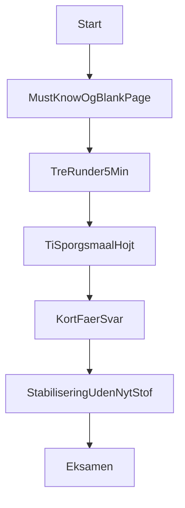

# Eksamenslæreplan – mundtlig videnskabsteori (5 min + 20 min)

**Formål:** Konkret implementering af læringsplanen: hvad du skal kunne, hvordan du træner det, og færdige svarskabeloner.  
**Kernefiler:** [BEGREBSKOMPENDIUM.md](BEGREBSKOMPENDIUM.md), [AKADEMISK_RAMME.md](AKADEMISK_RAMME.md), [UDDANNELSE_OG_PENSUM.md](UDDANNELSE_OG_PENSUM.md), din synopsis ([SYNOPSIS_INDIVIDUEL_VARIATION_A.md](SYNOPSIS_INDIVIDUEL_VARIATION_A.md)).  
**Pensum (Tier 1):** Holm (2023), Kuada (2012), Saunders (2023).

---

## Del A – Must-know (todo: extract-must-know)

### A.1 Memoréringscheckliste (sig højt uden noter)

| # | Begreb | 1 sætning du skal kunne |
|---|--------|-------------------------|
| 1 | **Pragmatisme** | Forsknings­spørgsmålet driver metoden; viden vurderes på **anvendelighed i casen**, ikke universelle love. |
| 2 | **Abduktion** | Vekslen mellem **observation** og **bedste foreløbige forklaring**; du **justerer**, når log og interview ikke matcher. |
| 3 | **Indlejret single-case** | Én organisation (SS), men **to analyseenheder**: workflow-states og beslutningsled (review/override). |
| 4 | **Analytisk generalisering** | Overførsel til **teori og mekanismer** (fx TOE/DSS/Lean som begreber) – **ikke** statistisk til “alle bureauer”. |
| 5 | **Triangulering (sekventiel)** | Først **mønstre i data** → så **forklaring i interview** → så **krydstjek**; afvigelse = grund til ny forklaring. |
| 6 | **C-T-D-C** | **C**redibility, **T**ransferability, **D**ependability, **C**onfirmability – se stikordskort for handling. |

### A.2 Fravalg du skal kunne begrunde (20 sek.)

- **Ikke ren positivisme:** “hvorfor” og organisatorisk praksis kan ikke stå alene på tal; interviews giver fortolkning af fx gates og governance.  
- **Ikke ren hermeneutik:** I har **systemloggede spor** (tid i state, loops, overrides) – ren fortolkning alene dækker ikke PF.

### A.3 Operationalisering af spildtid (husk listen)

Tid i state · beslutningstid i manuelle led · antal review-loops · override-rate · fordeling af rejection reasons.

### A.4 Blank-page test (5 min)

Luk alle filer. Skriv på papir:

`Pragmatisme | Abduktion | Indlejret case | Triangulering | C-T-D-C`

Tilføj én linje pr. ord. Alt du ikke kan skrive: genlæs kun den del i [BEGREBSKOMPENDIUM.md](BEGREBSKOMPENDIUM.md).

**Todo extract-must-know:** Udfør blank-page mindst én gang; gentag dagen før eksamen.

---

## Del B – 5 minutters præsentation (todo: train-5min)

### B.1 Tidslinje og indhold

| Tid | Slide-tema | Sig (kerne) |
|-----|------------|-------------|
| 0:00–0:45 | Problem / relevans | Tempo i bemanding er forretningskritisk; undersøgelsen handler om **spildtid og beslutningsmønstre** i SoluTalent – ikke “virker AI generelt”. |
| 0:45–1:30 | PF + afgrænsning | Læs PF **én gang** tydeligt. Scope: fra opgave **registreret/importeret i SoluTalent** til **kandidat klar til / indstillet til klientgodkendelse**; kvantitativt kun **systemloggede** trin; pre-system og post-match (kontrakt, faktura) **uden for scope**. |
| 1:30–2:40 | Videnskabsteori + slutning | **Pragmatisme** (Holm, Kuada; Saunders om mixed behov). **Abduktion** (Holm): mønstre i KPI → foreløbig forklaring → test mod interview → revision ved uenighed. Mini-eksempel: lang tid i review-led eller mange loops → forklares med kø, roller, risiko – ikke kun “systemet er langsomt”. |
| 2:40–3:40 | Design + data | **Eksplorativt indlejret single-case** (SS). Data: **platform-/KPI-spor** + **4–6 semistrukturerede interviews**; triangulering. |
| 3:40–4:40 | Kvalitet + bias | **C-T-D-C** med én handling hver (se stikordskort). **Insider:** styrke adgang / risiko normalisering → **negative indikatorer** (override, loops, afvisninger) vægtes ligeså højt som “gode” tal. |
| 4:40–5:00 | Output | Flaskehalse, forklaringer, **prioriterede forudsætninger** for forsvarlig reduktion af manuelle trin – beslutningsgrundlag, ikke quick fix. |

### B.2 Færdigt manus (ca. 5 min ved roligt tempo – tilpas navne/PF til din slide)

> “Jeg undersøger hvordan AI-baseret automatisering påvirker spildtid i bemandingsprocessen hos Support Solutions, når vi følger forløbet i SoluTalent fra opgaven ligger i systemet, til kandidat er klar til klientgodkendelse – og hvilke forudsætninger der skal være opfyldt for at kunne reducere manuelle trin forsvarligt.  
> Afgrænsningen er vigtig: den kvantitative del måler kun det, der logges i platformen; alt før stabil registrering og alt efter klientgodkendelse – fx kontrakt og fakturering – ligger uden for scope.  
> Videnskabsteoretisk lægger jeg en pragmatisk linje med udgangspunkt i Holm og Kuada: spørgsmålet kræver både observerbare spor og fortolkning af praksis, så viden vurderes på anvendelighed i casen. Slutningsformen er abduktiv: jeg går frem og tilbage mellem mønstre i data og forklaringer fra interviews og justerer, når kilderne ikke stemmer overens.  
> Designet er et eksplorativt indlejret single-case-studie med analyseenheder i workflowet og i beslutningsled som review og override. Empirien kombinerer KPI-spor fra SoluTalent med semistrukturerede interviews.  
> Kvalitet sikrer jeg med kriterier om troværdighed, overførbarhed, pålidelighed og bekræftbarhed – blandt andet gennem dokumentation af beslutninger og respondentvalidering hvor det giver mening. Som insider er jeg bevidst om bias: derfor er høj override-rate, gentagne loops og afvisningsmønstre analytisk lige så vigtige som gode gennemløbstider.  
> Outputtet er et grundlag for at prioritere, hvor der er reel spildtid, og hvilke betingelser der skal være på plads før man automatiserer yderligere.”

### B.3 Træningsprotokol (Sprint 2 fra planen)

1. **Runde 1:** Fremlæg med stopur; mål 4:45–5:15. Notér hvor du fylder for meget.  
2. **Runde 2:** Fjern fyldord; samme indhold, kortere sætninger.  
3. **Runde 3:** Uden at kigge på manus – kun stikordskortet ([EKSAMENS_STIKORDSKORT.md](EKSAMENS_STIKORDSKORT.md)).

**Todo train-5min:** Gennemfør alle tre runder mindst én gang før eksamen.

---

## Del C – Q&A: 10 kernespørgsmål med svarskabelon (todo: drill-qa)

**Skabelon for hvert svar:** (1) **Påstand** – direkte svar. (2) **Casekobling** – SoluTalent / SS. (3) **Begrænsning** – én linje.

### 1) Hvorfor pragmatisme og ikke positivisme eller hermeneutik?

- **Påstand:** Pragmatisme passer fordi PF kræver både **målbare procespor** og **forklaring af beslutningspraksis**; metoden følger spørgsmålet (Kuada; Saunders om blandet behov).  
- **Casekobling:** SoluTalent giver fx tid i state og overrides; interviews forklarer **hvorfor** fx gates er konservative eller teams handler forskelligt.  
- **Begrænsning:** Vi leverer ikke universelle love om AI – **kontekstbundet anvendelighed**.

### 2) Hvad er abduktion i praksis hos dig?

- **Påstand:** Abduktion er vekslen mellem **observation** og **bedste foreløbige forklaring**, med **revision** når kilder divergerer (Holm).  
- **Casekobling:** Fx høj ventetid i et review-led → hypotese om kø/få godkendere → testes mod interview og evt. roller i data.  
- **Begrænsning:** Det er **ikke** ren hypotese-test (deduktion) eller kun mønstre fra tekst (induktion alene).

### 3) Hvorfor case fremfor survey?

- **Påstand:** Casestudiet giver **dybde** i proces, teknologi og praksis i **naturlig kontekst** (Holm; Kuada; Saunders).  
- **Casekobling:** AI-forslag og manuelle reviews sidder i **samme workflow** – det kræver procesnær analyse, ikke spørgeskema alene.  
- **Begrænsning:** Ikke statistisk generalisering til hele branchen.

### 4) Hvad betyder “indlejret” case?

- **Påstand:** Flere **analysenheder** inden for én organisation.  
- **Casekobling:** **Enhed 1:** workflow-states i SoluTalent; **enhed 2:** beslutningspunkter (review, override, accept).  
- **Begrænsning:** Ikke det samme som flere separate cases.

### 5) Hvad er analytisk generalisering?

- **Påstand:** Generalisering til **teori, begreber og mekanismer** – hvad siger casen om fx governance, DSS eller spildkategorier – ikke til en population (Holm; Kuada).  
- **Casekobling:** Fx indsigt i **hvornår human-in-the-loop** skaber ventetid versus værdi.  
- **Begrænsning:** Andre virksomheder kan have andre workflows – **transferability** vurderes af læser.

### 6) Hvordan operationaliserer du spildtid?

- **Påstand:** Spildtid knyttes til **konkrete indikatorer** fra log og proces, ikke til vage opfattelser.  
- **Casekobling:** Tid i state, beslutningstid i manuelle led, antal loops, override-rate, rejection reasons.  
- **Begrænsning:** Ikke-loggede trin før systemet kan kun belyses **kvalitativt**.

### 7) Hvad gør du når interview og data ikke peger samme vej?

- **Påstand:** Afvigelse er **central i abduktion** – så undersøger jeg definitioner, roller, tidsrum og om begge spor er korrekte på hver deres måde.  
- **Casekobling:** Teknisk informant kan sige at log “viser hvad, ikke altid hvorfor” – så interview bliver forklaringsled.  
- **Begrænsning:** Jeg vælger ikke den kilde der passer bedst med hypotesen.

### 8) Hvordan håndterer du insider-bias?

- **Påstand:** Insider giver **adgang og forståelse**, men risiko for at **normalisere** eksisterende praksis (Kuada om confirmability).  
- **Casekobling:** Jeg lægger vægt på **negative KPI** og gentagne afvisningsmønstre; dokumenterer beslutninger (audit trail).  
- **Begrænsning:** Fuldstændig neutralitet findes ikke – **transparent** om begrænsning.

### 9) Hvad er studiets største begrænsning?

- **Påstand:** **Én case** og **afgrænset periode**; logs giver ikke altid fuld kausal forklaring alene.  
- **Casekobling:** Generalisering er **analytisk**; kausalitet kræver fortolkning via interviews.  
- **Begrænsning:** Det begrænser **statistisk** generalisering – ikke nødvendigvis **praktisk værdi** for SS.

### 10) Hvad gør resultaterne anvendelige trods begrænsninger?

- **Påstand:** Pragmatisk kriterium: **nytte som beslutningsgrundlag** i den konkrete kontekst (Kuada; Holm).  
- **Casekobling:** Prioriteret liste over flaskehalse, **mønstre** i KPI og **betingelser** for reduktion af manuelle trin.  
- **Begrænsning:** Anbefalinger skal **valideres** i drift – ikke én endelig sandhed.

**Todo drill-qa:** Besvar alle 10 højt (20–40 sek. hver); optag gerne og skær svar ned hvis de flyder over 45 sek.

---

## Del D – Træningssprints (samlet kalender)

| Sprint | Tid | Aktivitet |
|--------|-----|-----------|
| **1** | 45 min | Must-know + blank-page test (Del A). |
| **2** | 45 min | Tre runder 5-min (Del B.3). |
| **3** | 45 min | Q&A drill (Del C). |
| **4** | 20 min | Stabilisering (Del E) – aftenen før. |

---

## Del E – Aftenen før / på dagen (todo: final-stabilization)

### E.1 Stabiliseringscheckliste (max 20 min – intet nyt pensum)

- [ ] Læs kun [EKSAMENS_STIKORDSKORT.md](EKSAMENS_STIKORDSKORT.md) én gang igennem.  
- [ ] Sig **C-T-D-C** og **én handling** pr. bogstav højt.  
- [ ] Kør **én** rolig 5-min gennemgang (uden nyt manus).  
- [ ] Gennemgå **tre begrænsninger** du altid kan sige: single-case; logs ≠ fuld hvorfor; ikke statistisk generalisering.  
- [ ] Stop – søvn > sidste-minuts cram.

### E.2 Risiko på dagen (hurtig redning)

- **Blank hjerte:** Én definition (pragmatisme eller abduktion) → én sætning om SoluTalent → én begrænsning.  
- **AI-spørgsmål:** Brug **påvirker / indikerer**, undgå “beviser” og overdrevet kausalitet.  
- **Bred teori:** Start med **Holm/Kuada/Saunders**, tilføj klassisk begreb kun hvis du er sikker.

### E.3 Tre faste styrker (hav i baghovedet)

1. Triangulering af **platform + interview**.  
2. Tydelig **proces- og systemafgrænsning**.  
3. Eksplicit **bias- og kvalitetshåndtering**.

**Todo final-stabilization:** Udfør E.1 aftenen før (eller samme morgen).

---

## Flow (overblik)

---

*Denne fil implementerer læringsplanen for mundtlig eksamen; den erstatter ikke pensumbøgerne, men styrer hvad du prioriterer og hvordan du træner.*
