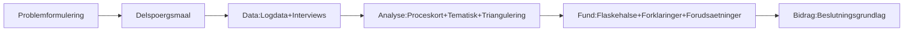

# NotebookLM Kildepakke til Luka (Eksamenspræsentation v17)

## Formål
Denne pakke er lavet til at generere en gennemgangsvideo, der forklarer:
- hvad hvert slide gør
- hvilken teori der bærer argumentet
- hvordan slidet indgår i analysekæden
- hvad du skal sige og undgå i mundtlig eksamen

## Inputgrundlag
- `Eksamenspræsentation - AI-automatisering i Bemandingsprocessen (17).pdf`
- `Synopsis – Automatisk Luka (1) (1).pdf`

## Fast scope-ordlyd (brug konsekvent)
Fra opgave registreret/importeret i SoluTalent til fundet kandidat til klientgodkendelse.  
Kvantitativ analyse kun i systemloggede trin.

## Teori-ankre (brug konsekvent)
- **Pragmatisk position:** Saunders et al. (2023), Holm (2023)
- **Mixed methods-integration:** Rossman and Wilson (1985)
- **Abduktion:** Holm (2023), Saunders et al. (2023)
- **Kuada (2012):** kun metodehåndvaerk og kvalitetskriterier (ikke ontologisk fundament)

## Analysekaede

## Hvad pakken indeholder
- `01_SLIDE_MAP.md` - slide-for-slide teori, analysekobling, sig/undgaa
- `02_SPEAKER_SCRIPT_5MIN.md` - stramt manus (45-60 sek per slide)
- `03_EXAM_WATCHOUTS.md` - faelder og forsvarslinjer
- `04_VIDEO_PROMPT_MASTER.md` - samlet prompt til hel video
- `05_VIDEO_PROMPTS_BY_SLIDE.md` - modulare prompts S1-S7
