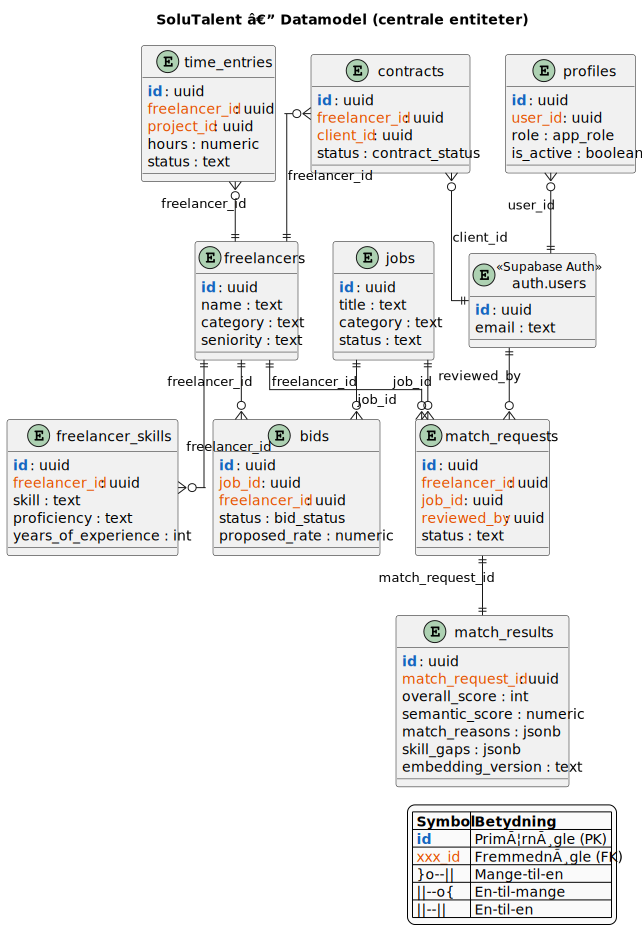
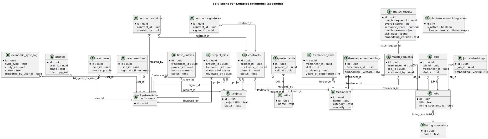

# AI-baseret beslutningsstøtte i B2B-talentplatforme

## En Design Science-analyse af SoluTalent

---

**Forfattere**: [INDSÆT NAVNE]

**Uddannelse**: HA(it.) — Bachelor i Økonomi og Informationsteknologi

**Uddannelsesinstitution**: [INDSÆT UNIVERSITET]

**Afleveringsdato**: [INDSÆT DATO]

**Vejleder**: [INDSÆT NAVN]

**Anslag**: [INDSÆT ANSLAG]

---

# 1. Indledning

## 1.1 Problemfelt

Digitale platforme skaber værdi ved at forbinde aktører på tværs af markeder og reducere friktion i matching-processer (Parker et al., 2016; Rochet & Tirole, 2003; Evans & Schmalensee, 2016). I en B2B-kontekst handler matching ikke kun om at finde et teknisk "fit", men også om governance, kvalitetssikring og kontraktlig håndtering (Parker et al., 2016; Boudreau & Hagiu, 2009). Samtidig rykker AI-baseret beslutningsstøtte tættere på centrale HR-processer, hvilket øger kravet til transparens, fairness og menneskelig kontrol (Raghavan et al., 2020; Selbst et al., 2019; Shneiderman, 2020).

## 1.2 Casepræsentation

Dette bachelorprojekt undersøger SoluTalent, en B2B talentplatform, som kombinerer AI-matchning med admin-medieret beslutningstagning. Platformen forbinder skandinaviske freelancere med virksomheder gennem en mellemmand, Support Solutions ApS, som varetager kvalitetskontrol, kontraktstyring og fakturering.

Projektet er forankret i Design Science Research (DSR) og behandler SoluTalent som et IT-artefakt, der kan analyseres og evalueres ud fra konkrete kvalitetskriterier (Hevner et al., 2004; Peffers et al., 2007). Den empiriske base er kodebasen og dens dokumentation, herunder arkitekturbeslutninger (ADR'er), workflow-dokumenter og sikkerhedsgennemgange.

## 1.3 Domæneanalyse: Beslutningsstøtte i rekruttering

Matching-platforme fungerer som tosidede markeder, hvor platformens rolle er at facilitere udveksling og samtidig regulere kvalitet og adgang (Rochet & Tirole, 2003; Boudreau & Hagiu, 2009). I rekrutteringsdomænet er beslutninger ofte komplekse og værdiladede. DSS- og human-in-the-loop-litteraturen argumenterer for, at AI bør fungere som beslutningsstøtte fremfor autonom beslutningstager (Dellermann et al., 2019; Parasuraman et al., 2000; Shneiderman, 2020). Dette betyder, at kvalitet i processen ikke kun måles på algoritmisk præcision, men på, om beslutninger kan begrundes og kontrolleres.

AI-løsninger kan forbedre matching-effektiviteten, men introducerer samtidig risici for bias og manglende transparens (Raghavan et al., 2020; Selbst et al., 2019). Disse udfordringer motiverer projektets fokus på human-in-the-loop design og transparens som centrale designprincipper.

---

# 2. Problemafgrænsning og problemformulering

## 2.1 Afgrænsning

Projektet afgrænses som følger:

- **Single-case studie**: Analysen er afgrænset til én platform (SoluTalent) i én organisatorisk kontekst (B2B talentformidling via Support Solutions). Generalisering er analytisk, ikke statistisk (Yin, 2018).
- **Artefaktfokus**: Evaluering bygger på kodebase-empiri og dokumentation, ikke på brugerdata eller performance-målinger. Effektmåling kræver logging-implementering (se kapitel 7).
- **AI som beslutningsstøtte**: Casen omhandler human-in-the-loop AI, ikke fuldautomatiske beslutningssystemer. Admin træffer alle endelige beslutninger.
- **Tidspunkt**: Analysen afspejler kodebasens tilstand per februar 2026.

## 2.2 Problemformulering

> **Hvordan kan et AI-understøttet matching-artefakt designes, så det både effektiviserer rekrutteringsprocessen og opretholder krav til transparens, governance og beslutningskvalitet i en B2B-platformkontekst?**

## 2.3 Underspørgsmål

1. Hvilke arkitektur- og designbeslutninger understøtter human-in-the-loop beslutningstagning i SoluTalent?
2. Hvordan implementeres transparens og sporbarhed i AI-matching-pipen?
3. Hvilke governance-mekanismer sikrer kvalitetskontrol på platformen?
4. Hvordan adresserer systemet potentielle bias-risici i AI-matchning?
5. Hvilke metrics kan måles med eksisterende data, og hvilke kræver yderligere implementering?
6. Hvad er de vigtigste trade-offs mellem automatisering og menneskelig kontrol i systemets design?

---

# 3. Teoretisk ramme

## 3.1 Design Science Research (DSR)

Projektet anvender DSR som overordnet forskningsramme (Hevner et al., 2004; Peffers et al., 2007). DSR er velegnet, fordi undersøgelsen centrerer sig om udvikling og evaluering af et IT-artefakt.

**Artefaktpositionering**: SoluTalent positioneres som "improvement" i DSR-typologien (Gregor & Hevner, 2013): kendt problem (freelancer-matching), ny løsning (AI-baseret matching med admin-mediering i skandinavisk kontekst).

**DSRM-fasestruktur** (Peffers et al., 2007):

| DSR-fase | Operationalisering |
|---|---|
| Problemidentifikation | Udfordringer ved freelancer-matching i konsulentbranchen |
| Løsningsdesign | Arkitekturbeslutninger dokumenteret som ADR'er |
| Udvikling | Implementering af SoluTalent-platformen |
| Evaluering | Analyse mod definerede succeskriterier |
| Kommunikation | Nærværende rapport |

**Tre-cyklus-modellen** (Hevner, 2007) anvendes til at balancere praktisk relevans (virksomhedsbehov) med forskningsstringens (akademisk evaluering).

## 3.2 Decision Support Systems og Human-in-the-Loop

SoluTalent's AI-matching fungerer som et beslutningsstøttesystem (DSS) for rekrutteringsadministratorer (Arnott & Pervan, 2005). Systemet implementerer hybrid intelligence — en kombination af menneskelig og maskinel beslutningstagning (Dellermann et al., 2019).

**Automatiseringsniveau**: Systemet klassificeres som niveau 5-6 i Parasuraman et al.'s (2000) ti-niveau model: AI foreslår handling, men menneske træffer beslutning. Admin kan altid overrule AI-anbefalinger.

**Human-Centered AI**: Shneiderman (2020) argumenterer for, at AI-systemer bør understøtte — ikke erstatte — menneskelig dømmekraft. SoluTalent implementerer dette gennem admin-medieret bidding, hvor AI leverer scores og forklaringer, mens admin træffer den endelige beslutning.

## 3.3 Platform Governance

Platforme fungerer som regulatorer, der sætter regler for deltagelse og kvalitet (Boudreau & Hagiu, 2009; Parker et al., 2016). SoluTalent implementerer governance gennem:

- **Adgangsregler**: Admin godkender freelancer-applikationer
- **Kvalitetsregler**: Admin-medieret bidding sikrer kvalitet
- **Interaktionsregler**: Dual-signature kontrakter, kontaktinfo-detektion

## 3.4 Ansvarlig AI

Responsible AI-litteraturen fremhæver transparens, fairness og accountability som kerneværdier (Jobin et al., 2019; Selbst et al., 2019; Raghavan et al., 2020). Potentielle bias-kilder i AI-matching inkluderer:

- **Historisk bias**: Embeddings kan afspejle bias fra træningsdata
- **Algoritmisk bias**: Vægtfordeling prioriterer bestemte faktorer
- **Mitigering**: Human-in-the-loop, transparent scoring, dokumenterede vægte

---

# 4. Metode og forskningsdesign

## 4.1 Videnskabsteoretisk position

Projektet positionerer sig inden for en **pragmatisk** videnskabsteoretisk tradition. Pragmatismen fokuserer på praktisk nytte og konsekvenser af viden (Dewey, 1938; James, 1907). Denne position er velegnet, fordi:

1. **Operationalisering**: Kvalitet defineres gennem operationelle succeskriterier (funktionalitet, sikkerhed, vedligeholdbarhed, integrationskvalitet).
2. **Metodisk pluralisme**: Kombination af datakilder legitimeres, så længe valget er begrundet.
3. **Kontekstafhængighed**: Løsningens kvalitet evalueres i relation til den specifikke organisatoriske kontekst.

## 4.2 Datakilder og evidenshierarki

| Niveau | Datakilde | Status | Karakter |
|---|---|---|---|
| **Primær** | Kodebase og ADR'er | Tilgængelig | Objektiv, versioneret |
| **Sekundær** | Teknisk dokumentation | Tilgængelig | Intern, deskriptiv |
| **Supplerende** | Interviews/observationer | TODO | Subjektiv, kontekstuel |

**Primær artefakt-empiri** omfatter:
- 172 React-komponenter + 65 sidekomponenter
- 40 Supabase Edge Functions
- 249 databasemigrationer
- 12 ADR'er (Architecture Decision Records)

## 4.3 Bias og forskerrolle

Forfatterne er tæt på casen (udviklerrolle), hvilket skaber potentiel bias. Denne nærhed håndteres ved:

- Basering på verificerbar kode og dokumentation
- Sporbarhed: Alle claims linkes til konkrete filstier
- Eksplicit angivelse af begrænsninger

## 4.4 Etik og GDPR

Platformen håndterer persondata og implementerer:

- **Dataminimering**: Embeddings indeholder ikke PII
- **Dataeksport**: GDPR art. 15 & 20 implementeret
- **Kontosletning**: 30-dages grace period
- **RLS-beskyttelse**: Row Level Security på alle tabeller

---

# 5. System- og procesanalyse

## 5.1 Arkitekturoversigt (C4)

SoluTalent er bygget som en moderne webapplikation med følgende lag:

| Lag | Teknologi | Funktion |
|---|---|---|
| Frontend | React 18, TypeScript, Tailwind | Brugergrænseflader |
| Backend | Supabase (PostgreSQL, Edge Functions, Auth) | Datalagring, forretningslogik |
| AI-lag | OpenAI API | Embeddings, matching-forklaringer |
| Integration | E-conomic API | Fakturering |

**Figur 5.1 — C4 Context Diagram**

*C4-kontekstdiagram der viser SoluTalent-platformen, tre brugerroller (Freelancer, Admin, Virksomhed) og fire eksterne services (OpenAI, E-conomic, Google OAuth, Resend). E-conomic bruges til fakturering — platformen håndterer ikke udbetalinger.*

Se Appendix A for evidens (claim→path).

**Figur 5.2 — C4 Container Diagram**

*C4-containerdiagram der viser deployable units: React SPA, Supabase Auth, PostgreSQL (med RLS), Realtime, og Edge Functions.*

Se Appendix A for evidens (claim→path).

## 5.2 Datamodel (ER)

Den centrale datamodel omfatter 10 kerneentiteter:

| Tabel | Formål |
|---|---|
| `profiles` | Brugerprofil + rolle |
| `freelancers` | Freelancer-data |
| `freelancer_skills` | Kompetencer (input til matching) |
| `jobs` | Jobopslag |
| `match_requests` | AI match-forespørgsler med status-workflow |
| `match_results` | Match-scores, forklaringer, skill gaps |
| `bids` | Freelancer-bud |
| `contracts` | Kontrakter |
| `time_entries` | Tidsregistrering |

**Bemærk**: Tabellerne `payment_accounts` og `withdrawals` er fjernet fra databasen (migration `20251209`). Platformen håndterer fakturering via E-conomic, ikke direkte udbetalinger.

**Figur 5.3 — ER-diagram (Light)**

*Forenklet ER-diagram med centrale entiteter. Komplet ER-diagram i Appendix B.*

Se Appendix A for evidens (claim→path).

## 5.3 Processer: As-Is og To-Be

### As-Is flow (uden AI-støtte)

Det nuværende produktionsflow er primært regelbaseret:

1. Freelancer søger job og afgiver bud
2. Admin gennemgår bud (erfaringsbaseret vurdering)
3. Forhandling ved modforslag
4. Kontrakt genereres og signeres (dual-signature)
5. Tidsregistrering → Fakturering via E-conomic

**Figur 5.4 — Process As-Is**

*Nuværende bud-til-fakturering flow uden AI-støtte. Matching er erfaringsbaseret.*

Se Appendix A for evidens (claim→path).

### To-Be flow (med AI-beslutningsstøtte)

Systemet har kapabilitet til AI-baseret beslutningsstøtte, som kan aktiveres on-demand:

1. Freelancer søger job og afgiver bud
2. **AI-matching** (on-demand/admin-initieret): Semantisk + regelbaseret scoring
3. Admin gennemgår bud **med** AI-anbefaling (score + forklaring)
4. Forhandling, kontrakt, signering
5. Tidsregistrering → Fakturering

**Figur 5.5 — Process To-Be**

*Bud-til-fakturering flow med AI-beslutningsstøtte. AI-matching trigges on-demand, ikke automatisk ved bud. Admin forbliver beslutningspunkt.*

Se Appendix A for evidens (claim→path).

**Vigtigt**: AI-match funktionen trigges on-demand via edge function (`supabase/functions/ai-match/`), ikke automatisk ved bud-submission. Freelancer-dashboardet bruger aktuelt regelbaseret matching (`useCalculateMatchFitScore`), ikke AI-versionen.

## 5.4 AI-Matching Pipeline

**Figur 5.6 — AI-matchningspipeline**

*Dataflowdiagram over AI-matchningspipen fra input til admin-beslutning. AI leverer beslutningsstøtte; admin træffer beslutning.*

Se Appendix A for evidens (claim→path).

**Hybrid matching-tilgang**:

| Komponent | Vægt | Beskrivelse |
|---|---|---|
| Semantisk similarity | 40% | OpenAI `text-embedding-3-small`, cosine distance |
| Regelbaseret scoring | 60% | Skills (25%), erfaring (15%), kategori (10%), lokation (5%), senioritet (5%) |

**Forklaringer**: Match-forklaringer genereres via GPT-4o-mini og persisteres i `match_results.match_reasons`.

**Transparens**: Vægte (`weights_used`) returneres i API-response og persisteres i `match_analytics`-tabellen (ikke i `match_results`).

---

# 6. Løsnings- og designovervejelser

## 6.1 Human-in-the-Loop som designprincip

Systemet er bevidst designet med admin som central beslutningstager:

| Designvalg | Rationale | Evidens |
|---|---|---|
| Admin-medieret bidding | Kvalitetskontrol, reducerer platform-risiko | ADR-005 |
| AI som beslutningsstøtte | Effektivisering uden at fjerne menneskeligt skøn | ADR-009 |
| Dual-signature kontrakter | Juridisk sikkerhed, commitment fra begge parter | ADR-008 |

**Trade-off**: Admin-mediering kan blive en flaskehals ved højt volumen. AI-scoring kan reducere kognitiv load og accelerere gennemgang.

## 6.2 Transparens og auditability

Systemet implementerer transparens på flere niveauer:

1. **Match-forklaringer**: GPT-genererede forklaringer for hver match
2. **Score-breakdown**: Detaljeret opdeling (semantisk, skills, erfaring osv.)
3. **Rejection reasons**: Admin kan logge afvisningsårsager for feedback
4. **Audit trail**: Statusændringer logges med tidsstempler

## 6.3 Governance-mekanismer

| Mekanisme | Implementering | Formål |
|---|---|---|
| Kontaktinfo-detektion | `contactInfoDetector.ts` | Forhindrer off-platform deals |
| RLS-policies | 585 policies på alle tabeller | Database-niveau adgangskontrol |
| Roller og rettigheder | `user_roles` tabel | Single source of truth for RBAC |

## 6.4 Trade-offs

| Dimension | Valg | Alternativ | Rationale |
|---|---|---|---|
| Automatisering | Lav (human-in-the-loop) | Høj (fuld automatisering) | Kvalitetskontrol, accountability |
| Matching-kompleksitet | Hybrid (embeddings + regler) | Kun embeddings | Forklarbarhed, bias-mitigation |
| Fakturering | Ekstern (E-conomic) | In-house | Compliance, separation of concerns |

---

# 7. Evaluering

## 7.1 Artefakt-evaluering (hvad kan evalueres nu)

Evalueringen følger FEDS-frameworket (Venable et al., 2016): summativ, artificialistisk evaluering baseret på statisk kodeanalyse.

| Kriterie | Operationalisering | Status | Evidens |
|---|---|---|---|
| **Funktionalitet** | Kerneworkflows implementeret | ✅ | `docs/flows/` (6 dokumenter) |
| **Sikkerhed** | RLS, auth, PII-beskyttelse | ✅ | `SECURITY_AUDIT_DEC2025.md` |
| **Vedligeholdbarhed** | Kodestruktur, ADR'er | ⚠️ Blandet | `system-assessment.md` |
| **Integrationskvalitet** | API-integrationer fungerer | ✅ | 40 Edge Functions |

**Begrænsning**: Artefakt-evaluering dokumenterer *hvad der er implementeret*, ikke *hvordan det anvendes i praksis*.

## 7.2 Metrics feasibility

| Metric | Definition | Status | Datakilde |
|---|---|---|---|
| High-score rate | Andel matches ≥ threshold | ✅ YES | `match_results.overall_score` |
| Bid→Contract conversion | Andel bids → kontrakt | ✅ YES | `bids` + `contracts` |
| Match-score fordeling | Histogram af scores | ✅ YES | `match_results` |
| Godkendelsesrate | Andel approved matches | ✅ YES | `match_requests.status` |
| E-conomic sync rate | Vellykkede syncs | ✅ YES | `economic_sync_log` |
| Time-to-match | Tid job→match godkendt | ³ PARTIAL | Mangler `reviewed_at` trigger |
| Admin override rate | Høj-score afvist | ³ PARTIAL | Mangler kobling score↔rejection |
| Time-to-contract | Tid job→kontrakt signeret | ³ PARTIAL | Mangler `signed_at` timestamp |

**Legend**: ✅ YES = Kan måles nu · ³ PARTIAL = Kræver minor schema-ændring

Se `METRICS_FEASIBILITY.md` for detaljeret gap-analyse.

## 7.3 Future work

Følgende kræver implementering før måling:

1. **Logging-infrastruktur**: Event-baseret logging (jf. `LOGGING_SPEC.md`)
2. **A/B-test setup**: AI-support vs. ingen AI-support
3. **Brugertest**: Usability med admin-brugere
4. **Rejection reason persistering**: Tilføj kolonne til `match_requests`

---

# 8. Diskussion

## 8.1 Forretningsværdi vs. risiko

**Potentiel værdi**:
- Reduceret time-to-match gennem AI-screening
- Konsistens i vurderinger (transparente vægte)
- Skalerbarhed (AI kan screene mange kandidater)

**Risici**:
- **Bias**: Embeddings kan afspejle træningsdata-bias (mitigeret via hybrid tilgang)
- **Governance**: Admin-mediering kan blive flaskehals
- **Datakvalitet**: AI-kvalitet afhænger af profildata-kvalitet

## 8.2 Validitet og begrænsninger

| Begrænsning | Implikation |
|---|---|
| Single-case studie | Begrænset generaliserbarhed |
| Kode ≠ praksis | Kan ikke dokumentere faktisk brug |
| Forskerposition | Potentiel bias (udviklerrolle) |
| AI-assisteret audit | Sikkerhedsaudit ikke ekstern uafhængig |
| Tidspunkt | Snapshot — kode ændres løbende |

**Intern validitet** sikres gennem sporbarhed (alle claims → filstier) og versionskontrol.

**Ekstern validitet** er begrænset, men designprincipper kan overføres til lignende platforme.

## 8.3 Teoretisk bidrag

Projektet bidrager med indsigt i:

1. **DSR + DSS/HITL i platformkontekst**: Konkret eksempel på human-in-the-loop AI-design
2. **Governance som fairness-mekanisme**: Admin-mediering som praktisk bias-kontrol
3. **Transparens som arkitektur**: Forklaringsdata og auditability som designkrav

---

# 9. Konklusion

Problemformuleringen spurgte: *Hvordan kan et AI-understøttet matching-artefakt designes, så det både effektiviserer rekrutteringsprocessen og opretholder krav til transparens, governance og beslutningskvalitet?*

Analysen viser, at SoluTalent adresserer dette gennem:

1. **Human-in-the-loop design**: Admin træffer alle endelige beslutninger; AI leverer beslutningsstøtte (scores, forklaringer)
2. **Hybrid matching**: 40% semantisk + 60% regelbaseret scoring reducerer bias-afhængighed af embeddings
3. **Transparens**: Match-forklaringer, score-breakdown, vægte dokumenteret og returneret
4. **Governance**: Admin-medieret bidding, dual-signature kontrakter, kontaktinfo-detektion

**Begrænsninger**: Effektmåling kræver logging-implementering. AI-matching er implementeret som on-demand kapabilitet, ikke automatisk produktionsfunktion. Single-case studie begrænser generaliserbarhed.

**Samlet vurdering**: Artefaktet demonstrerer en viable tilgang til AI-beslutningsstøtte i B2B-platforme, men effektdokumentation kræver yderligere dataindsamling.

---

# 10. Perspektivering

Projektets indsigter kan perspektiveres til:

**Bredere anvendelse**: Designprincipperne (human-in-the-loop, transparent scoring, governance-mekanismer) kan overføres til andre matching-platforme (jobportaler, dating-apps, B2B-markedspladser).

**Regulatorisk kontekst**: EU's AI Act kategoriserer HR-systemer som "high-risk AI". SoluTalent's human-in-the-loop design og transparens adresserer flere krav i denne kategori.

**Teknologisk udvikling**: Forbedrede embedding-modeller og lavere API-omkostninger kan muliggøre mere avanceret matching uden at kompromittere forklarbarhed.

**Fremtidig forskning**: Naturalistisk evaluering med faktiske brugerdata ville styrke evidensgrundlaget. A/B-test mellem AI-støttet og manuel matching kunne kvantificere effekt.

---

# 11. Referencer

Se `docs/bachelor/references.bib` for komplet litteraturliste med 27+ referencer fordelt på:

- Design Science Research (Hevner et al., 2004; Peffers et al., 2007; Gregor & Hevner, 2013; Venable et al., 2016)
- Decision Support Systems (Arnott & Pervan, 2005; Dellermann et al., 2019; Parasuraman et al., 2000)
- Platform/Marketplace (Parker et al., 2016; Boudreau & Hagiu, 2009; Rochet & Tirole, 2003)
- Responsible AI (Raghavan et al., 2020; Selbst et al., 2019; Jobin et al., 2019)
- Software Architecture (Bass et al., 2021; Kruchten, 2012)

---

# Bilag

## Appendix A: Figur-evidens (Claim → Repo-kilde)

Se `docs/bachelor/APPENDIX_FIGURE_EVIDENCE.md` for komplet mapping fra hvert visuelt element til konkret kildekode.

**Styrke-vurdering**: ✅ Stærk (direkte kode/linje) · ⚠️ Delvis (dokumentation) · ❌ Mangler

**Eksempel (F1 — AI-pipeline)**:
- CV Parsing: `supabase/functions/parse-cv/index.ts:212` ✅
- Embedding-model: `supabase/functions/generate-embeddings/index.ts:151` ✅
- DEFAULT_WEIGHTS: `supabase/functions/ai-match/index.ts:79-87` ✅
- Match-forklaring (GPT): `supabase/functions/ai-match/index.ts:523` ✅

## Appendix B: Komplet ER-diagram

*Komplet ER-diagram med alle centrale tabeller. Bemærk: `payment_accounts` og `withdrawals` er fjernet (migration `20251209`).*

## Appendix C: Logging-specifikation

Se `docs/bachelor/LOGGING_SPEC.md` for:
- Event-oversigt (11 events)
- Fælles felter (6 felter)
- Domænespecifikke felter
- Måleplan (5 afledte metrics)

## Appendix D: Ændringslog

Se `docs/bachelor/CHANGELOG_DOCS_AND_FIGURES.md` for dokumentation af:
- AI-match trigger (on-demand, ikke automatisk)
- Fjernede tabeller (payment_accounts, withdrawals)
- Terminologi-rettelser (betaling → fakturering)
- weights_used placering (API-response + match_analytics, ikke match_results)

---

*Rapport genereret: 2026-02-09*

