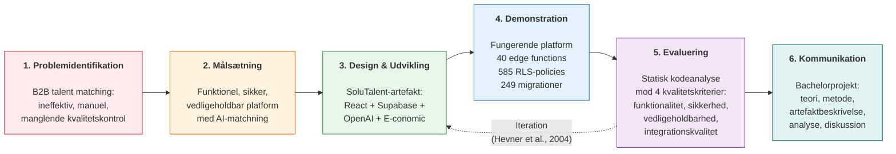
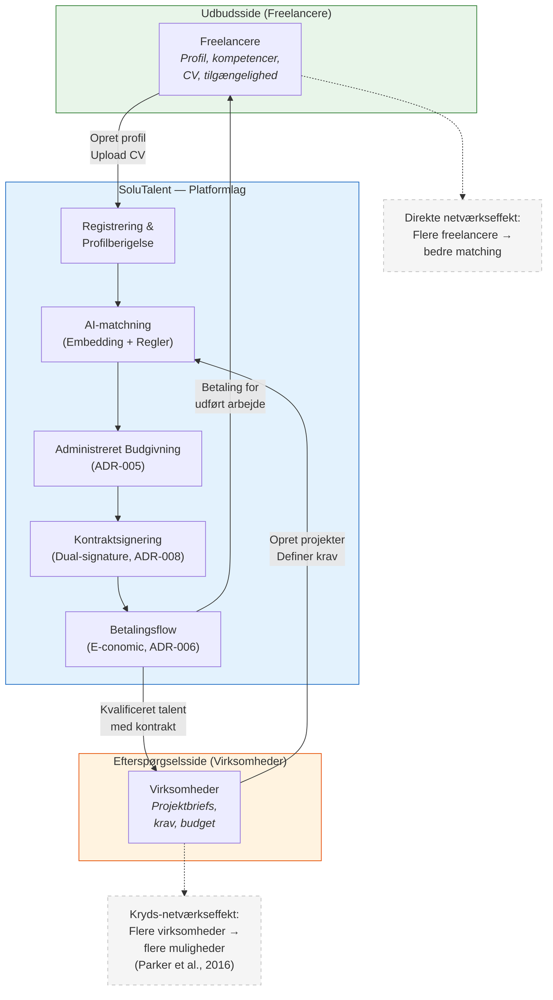
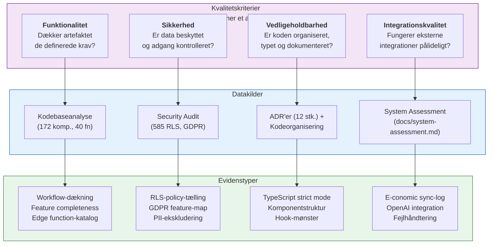
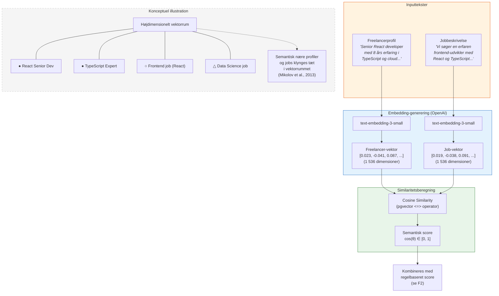

# Konceptuelle figurer (K1–K4)

> **Status**: Alle figurer er eksplicit markeret som **"Konceptuel figur — egen tilvirkning"**.
> Teoretisk grundlag og litteraturhenvisninger er angivet under hver figur.
> Mermaid-koden kan renderes via GitHub, Mermaid Live Editor, eller LaTeX (mermaid-filter).

---

## K1 — DSR-cyklus tilpasset SoluTalent-projektet

**Konceptuel figur — egen tilvirkning**
**Teoretisk grundlag**: Peffers, K. et al. (2007) "A Design Science Research Methodology for Information Systems Research." *JMIS*, 24(3), 45–77; Hevner, A.R. et al. (2004) "Design Science in Information Systems Research." *MIS Quarterly*, 28(1), 75–105.

**Mapping til Peffers et al. (2007), figur 1**:

| DSR-fase (Peffers) | SoluTalent-kontekst | Evidens |
|---------------------|---------------------|---------|
| Problem identification | B2B talent matching med kvalitetssikring | Projektbeskrivelse |
| Define objectives | Platform der forbinder freelancere med virksomheder via AI | ADR'er, kravspecifikation |
| Design & development | Full-stack udvikling over 12+ måneder | 249 migrationer, 40 edge functions |
| Demonstration | Funktionel platform med alle kerneflows | Kodebase, live artefakt |
| Evaluation | Statisk kodeanalyse, security audit | `system-assessment.md`, `SECURITY_AUDIT_DEC2025.md` |
| Communication | Bachelorprojekt (dette dokument) | Afhandling |

---

## K2 — Platform-værdiskabelse (to-sidet marked)

**Konceptuel figur — egen tilvirkning**
**Teoretisk grundlag**: Parker, G.G. et al. (2016) *Platform Revolution*; Rochet, J.-C. & Tirole, J. (2003) "Platform Competition in Two-Sided Markets." *JEEA*, 1(4), 990–1029; Evans, D.S. & Schmalensee, R. (2016) *Matchmakers.*

**Teoretiske begreber illustreret**:

| Begreb | Kilde | Manifestation i SoluTalent |
|--------|-------|---------------------------|
| To-sidet marked | Rochet & Tirole (2003) | Freelancere (udbud) + Virksomheder (efterspørgsel) |
| Kryds-netværkseffekt | Parker et al. (2016) | Flere freelancere gør platformen værdifuld for virksomheder og omvendt |
| Matching-platform | Evans & Schmalensee (2016) | AI-baseret matching som kernefunktion |
| Platform-governance | Parker et al. (2016) | Admin-medieret budgivning (ADR-005) sikrer kvalitetskontrol |
| Tillid & verifikation | Hagiu & Wright (2015) | Dual-signature kontrakter, profilverifikation |

---

## K3 — Evalueringsramme (succeskriterier → datakilder → evidenstyper)

**Konceptuel figur — egen tilvirkning**
**Teoretisk grundlag**: Hevner, A.R. et al. (2004) "Design Science in Information Systems Research." *MIS Quarterly*, 28(1), 75–105 — særligt evaluerings­sektionen; Gregor, S. & Hevner, A.R. (2013) "Positioning and Presenting Design Science Research for Maximum Impact." *MIS Quarterly*, 37(2), 337–355.

**Mapping til Hevner et al. (2004), tabel 2 — Design Evaluation Methods**:

| Evalueringsmetode (Hevner) | Anvendt i projektet | Begrænsning |
|---------------------------|---------------------|-------------|
| Observational — Case Study | Single-case studie af SoluTalent | Begrænset generaliserbarhed (Yin, 2018) |
| Analytical — Static Analysis | Kodegennemgang, komponent-tælling, pattern-analyse | Ingen runtime-data |
| Analytical — Architecture Analysis | ADR-gennemgang, module interaction-analyse | Dokumentation ≠ praksis |
| Testing — Structural | RLS-policy-verifikation, type-checking | Ikke udtømmende test-suite |

---

## K4 — Embedding-baseret matchning (konceptuel)

**Konceptuel figur — egen tilvirkning**
**Teoretisk grundlag**: Mikolov, T. et al. (2013) "Efficient Estimation of Word Representations in Vector Space." *arXiv:1301.3781*; OpenAI dokumentation for `text-embedding-3-small` (2024).

> **NB**: SoluTalent anvender OpenAI `text-embedding-3-small` (2024), ikke word2vec. Mikolov-referencen forklarer det konceptuelle grundlag for semantisk vektorrepræsentation. OpenAI's model er en videreudvikling af samme princip.

**Konceptuel forklaring**:

| Trin | Beskrivelse | Teknisk implementering i SoluTalent |
|------|-------------|--------------------------------------|
| 1. Tekstnormalisering | Profildata samles til én tekst uden PII | `generate-embeddings/index.ts` — "Normalized profile text (no PII)" |
| 2. Embedding-generering | Tekst → 1 536-dimensionel vektor | OpenAI `text-embedding-3-small` via Edge Function |
| 3. Vektorlagring | Vektorer gemmes i PostgreSQL | pgvector-extension, `freelancer_embeddings` / `job_embeddings` tabeller |
| 4. Similaritetssøgning | Cosine similarity mellem job- og freelancer-vektorer | pgvector `<=>` operator (1 – cosine distance) |
| 5. Score-kombination | Semantisk score (40 %) + regelbaseret (60 %) | `ai-match/index.ts` linje 78–87 (`DEFAULT_WEIGHTS`) |

**Relation til word2vec-konceptet (Mikolov et al., 2013)**:
- **Grundprincip**: Ord/tekster med lignende kontekst placeres tæt i vektorrummet
- **Udvidelse**: Moderne embedding-modeller (som OpenAI's) anvender transformer-arkitektur i stedet for word2vec's shallow neural networks
- **Fordel for matchning**: Semantisk lighed fanges automatisk — "React developer" og "frontend-udvikler" placeres tæt, selvom ordene er forskellige

---

*Genereret: 2026-02-09 — Alle konceptuelle figurer er markeret som "egen tilvirkning" med eksplicit kildehenvisning.*

