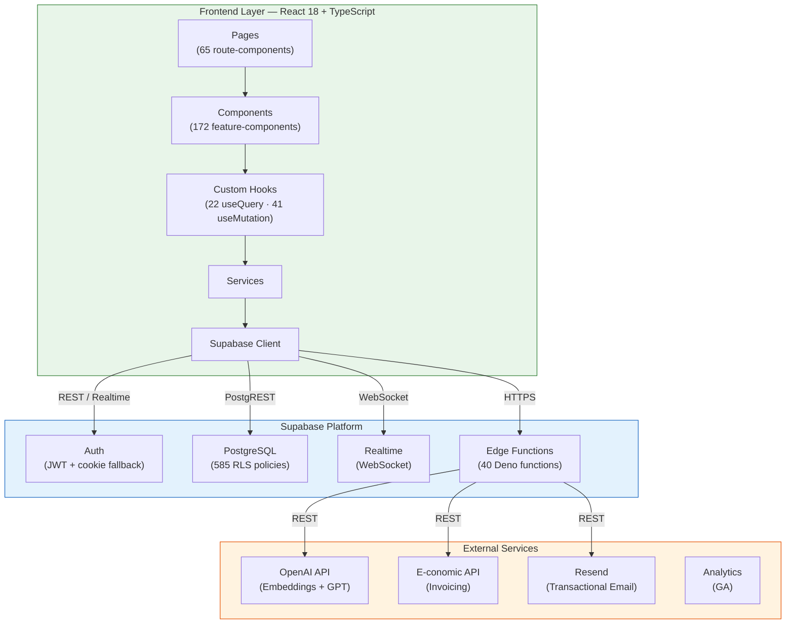
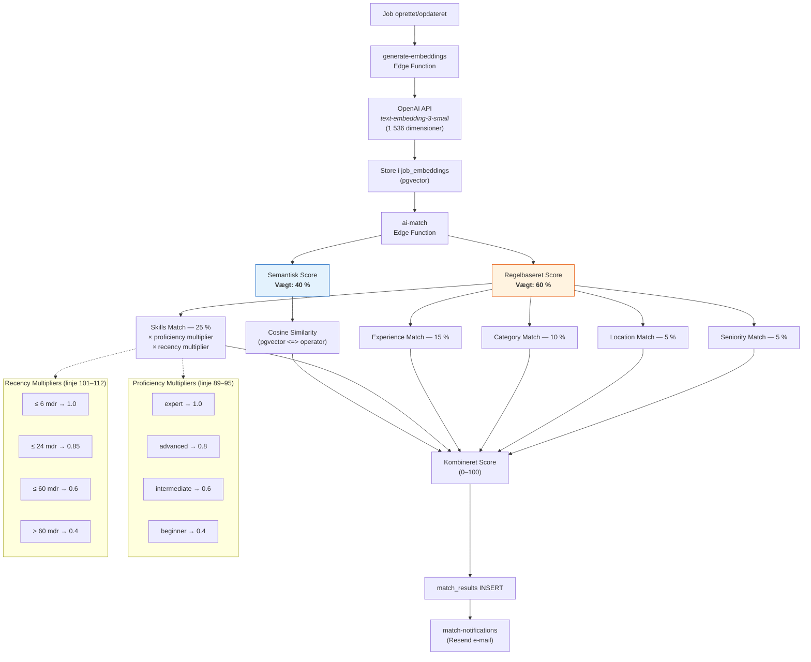
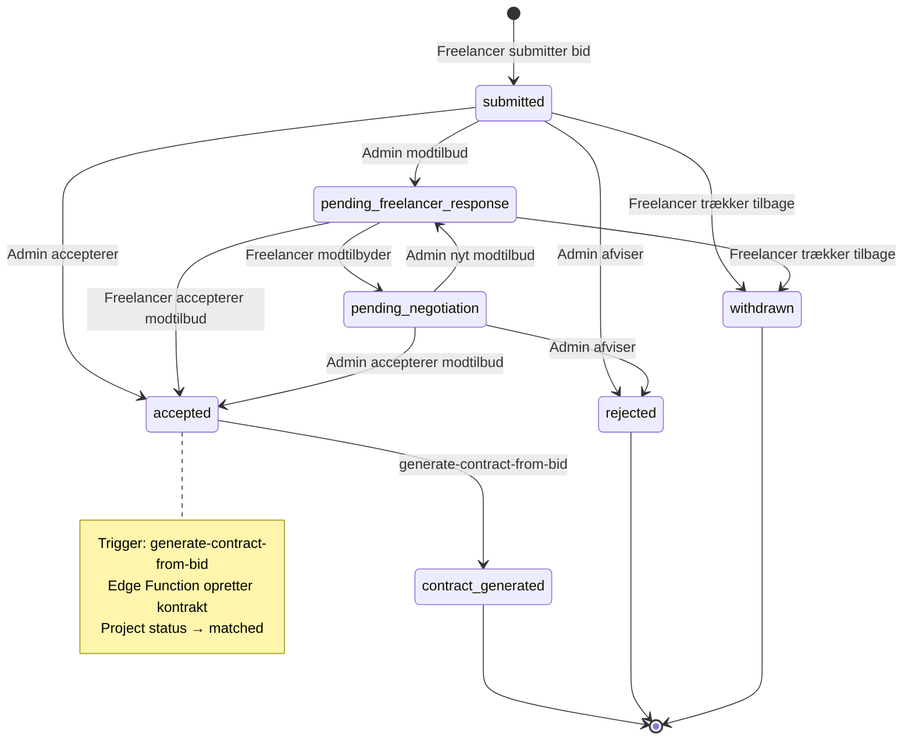
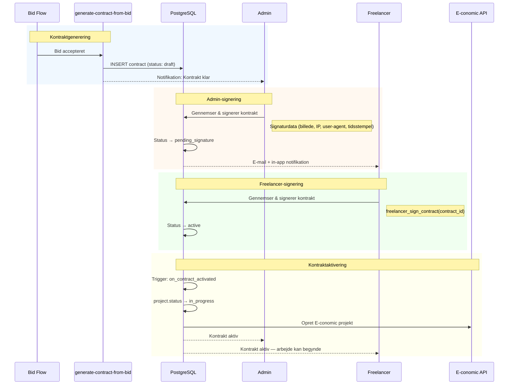
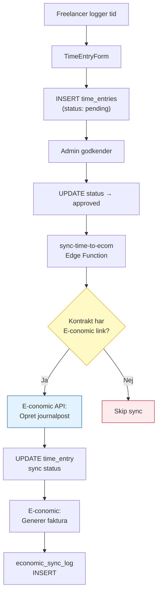
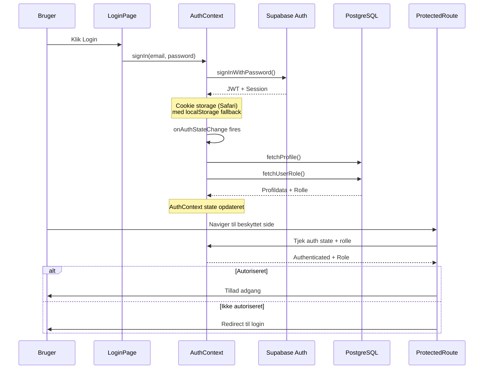
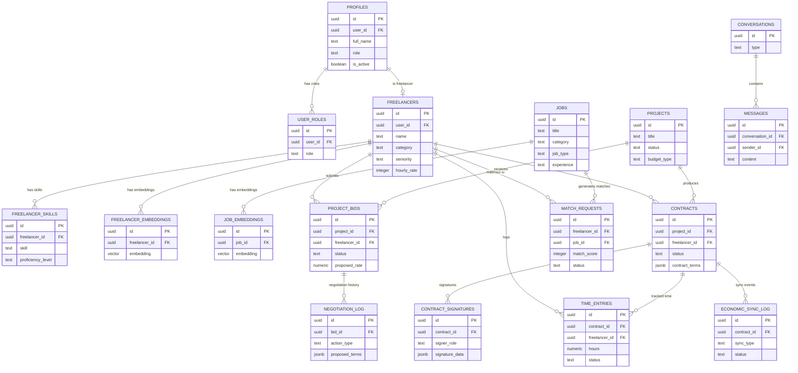
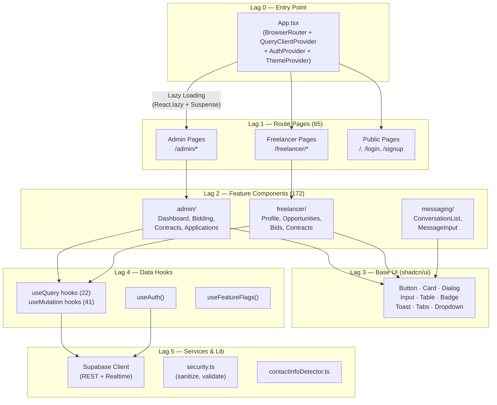

# Repo-afledte figurer (F1–F13)

> **Kilde**: Alle diagrammer er direkte afledt af SoluTalent-kodebasen.
> Filstier til primærkilde er angivet under hver figur.
> Mermaid-koden kan renderes via GitHub, Mermaid Live Editor, eller LaTeX (mermaid-filter).

---

## F1 — Overordnet systemarkitektur (3-lags)

**Kilde**: `docs/MODULE_INTERACTIONS.md` linje 9–31

---

## F2 — AI-matchningspipeline (hybrid scoring)

**Kilder**:
- `supabase/functions/ai-match/index.ts` linje 78–112 (vægte, proficiency, recency)
- `supabase/functions/generate-embeddings/index.ts` linje 151 (`text-embedding-3-small`)
- `docs/MODULE_INTERACTIONS.md` linje 170–211

---

## F3 — Bidding-workflow (tilstandsmaskine)

**Kilder**:
- `docs/flows/FLOW_BIDDING.md` linje 12–61
- `docs/ARCHITECTURE_DECISIONS.md` ADR-005 (Admin-Mediated Bidding)

---

## F4 — Kontraktsigneringsflow (dual-signature)

**Kilder**:
- `docs/flows/FLOW_CONTRACT_SIGNING.md` linje 12–56
- `docs/ARCHITECTURE_DECISIONS.md` ADR-008 (Dual-Signature Contract Flow)

---

## F5 — E-conomic integrationsflow (tidsregistrering → faktura)

**Kilder**:
- `docs/MODULE_INTERACTIONS.md` linje 248–281
- `docs/ARCHITECTURE_DECISIONS.md` ADR-006 (E-conomic for Payments)

---

## F6 — Autentificeringsflow

**Kilder**:
- `docs/MODULE_INTERACTIONS.md` linje 68–97
- `docs/ARCHITECTURE_DECISIONS.md` ADR-003 (Safari Cookie Storage Fallback)
- `src/integrations/supabase/client.ts`

---

## F7 — Teknologisk stack-oversigt

**Kilder**: `package.json`; `docs/ARCHITECTURE_DECISIONS.md` (ADR-002, ADR-003, ADR-009, ADR-011)

| Lag | Teknologi | Version | Formål | ADR |
|-----|-----------|---------|--------|-----|
| **Frontend** | React | 18.3 | UI-framework | — |
| | TypeScript | 5.5 | Type safety | — |
| | Tailwind CSS | 3.4 | Utility-first styling | — |
| | shadcn/ui | — | Komponentbibliotek (Radix-baseret) | — |
| | TanStack React Query | 5.x | Server state management | ADR-002 |
| | React Hook Form + Zod | — | Formhåndtering + validering | — |
| | Vite | 5.x | Build tool + code splitting | ADR-011 |
| **Backend** | Supabase (PostgreSQL) | — | Database + Auth + Realtime | — |
| | Supabase Edge Functions | Deno | Serverless business logic (40 fn) | — |
| | pgvector | — | Vector similarity search | ADR-009 |
| | Row Level Security | — | 585 policies | — |
| **AI** | OpenAI text-embedding-3-small | — | Embedding-generering (1 536 dim) | ADR-009 |
| | OpenAI gpt-4o-mini | — | CV-parsing (tekst) + match-forklaringer | ADR-009 |
| | OpenAI gpt-4o | — | CV-parsing (vision) | ADR-009 |
| **Hosting** | Netlify | — | Frontend hosting + CDN | — |
| | Supabase Cloud | — | Backend hosting | — |
| **Integration** | E-conomic API | — | Bogføring + fakturering | ADR-006 |
| | Resend | — | Transaktionelle e-mails | — |

---

## F8 — Database-domænemodel (forenklet ER-diagram)

**Kilder**:
- `docs/DATABASE_SCHEMA.md`
- `supabase/migrations/archive/` (249 migrationer)

---

## F9 — ADR-oversigt (beslutningskort)

**Kilde**: `docs/ARCHITECTURE_DECISIONS.md` (12 ADR'er)

| ADR | Beslutning | Kategori | Nøglekonsekvens |
|-----|-----------|----------|----------------|
| ADR-001 | User Roles via Dedicated Table | Sikkerhed | Forhindrer privilege-eskalering via profilmanipulation |
| ADR-002 | React Query for Server State | Frontend | Automatisk caching; ingen Redux nødvendig |
| ADR-003 | Safari Cookie Storage Fallback | Frontend | Auth virker i Safari private mode |
| ADR-004 | Projects vs Jobs Table Unification | Database | Enkelt kilde for projekt-entiteter |
| ADR-005 | Admin-Mediated Bidding | Forretningslogik | Platform kontrollerer matchkvalitet |
| ADR-006 | E-conomic for Payments | Integration | Dansk bogføringscompliance |
| ADR-007 | Contact Info Detection | Sikkerhed | Forhindrer platform-omgåelse i chat |
| ADR-008 | Dual-Signature Contract Flow | Forretningslogik | Juridisk gyldige elektroniske kontrakter |
| ADR-009 | OpenAI for AI Features | AI | Hybrid matching: semantisk + regelbaseret |
| ADR-010 | Feature Flags | Frontend | Gradvis feature-udrulning |
| ADR-011 | Code Splitting | Frontend | Lazy loading via Vite manualChunks |
| ADR-012 | Security Definer with Fixed Search Path | Sikkerhed | Forhindrer search_path-angreb på functions |

---

## F10 — GDPR-compliance feature-map

**Kilder**:
- `src/pages/FreelancerSettingsPage.tsx` linje 1021 (handleExportData), linje 1387 (handleDeleteAccount)
- `supabase/migrations/archive/2025-Q1/20250120000000_gdpr_account_deletion.sql`
- `supabase/migrations/archive/2025-Q1/20250127000001_gdpr_account_deletion_enhancement.sql`
- `supabase/migrations/archive/2025-Q1/20250203000000_create_ai_matching_schema.sql` linje 114
- `docs/SECURITY_AUDIT_DEC2025.md` sektion 7

| GDPR-artikel | Krav | Implementering | Kodebase-evidens |
|-------------|------|---------------|-----------------|
| Art. 15 — Ret til indsigt | Dataeksport | `handleExportData()` — JSON-download af profil, skills, bids, kontrakter | `FreelancerSettingsPage.tsx:1021` |
| Art. 17 — Ret til sletning | Kontosletning | Soft delete → 30-dages grace period → permanent sletning | `20250120000000_gdpr_account_deletion.sql` |
| Art. 17 (udvidet) | Grace period | `deletion_scheduled_at = now() + 30 days` | `20250127000001_gdpr_account_deletion_enhancement.sql` |
| Art. 20 — Dataportabilitet | Struktureret eksport | JSON-format download af alle persondata | `FreelancerSettingsPage.tsx:1021` |
| Art. 25 — Data Protection by Design | PII-ekskludering fra embeddings | "Normalized profile text (no PII)" i embedding-pipeline | `20250203000000_create_ai_matching_schema.sql:114` |
| Art. 25 — Offentlig visning | PII-beskyttelse | `public_freelancers` view ekskluderer sensitiv data | `SECURITY_AUDIT_DEC2025.md` sektion 7 |
| Art. 32 — Sikkerhed | Row Level Security | 585 RLS-policies på alle tabeller | Kodebase (verificeret via `CREATE POLICY`-tælling) |
| — | Eksplicit bekræftelse | Brugeren skal skrive "DELETE" for at bekræfte sletning | `FreelancerSettingsPage.tsx:1400` |

---

## F11 — Frontend-komponenthierarki (page → hook → service)

**Kilder**:
- `src/App.tsx` (routing + lazy loading)
- `src/hooks/` (22 useQuery, 41 useMutation)
- `src/components/` (172 komponenter)

---

## F12 — Edge function-katalog (40 funktioner pr. domæne)

**Kilde**: `supabase/functions/` (40 funktioner)

| Domæne | Edge Function | Formål |
|--------|--------------|--------|
| **AI & Matching** | `ai-match` | Hybrid scoring (semantisk + regelbaseret) |
| | `generate-embeddings` | Generér OpenAI embeddings for profiler/jobs |
| | `automatic-match` | Automatisk matching ved job-oprettelse |
| | `match-notifications` | Send match-notifikationer |
| | `parse-cv` | CV-parsing (tekst, gpt-4o-mini) |
| | `parse-cv-vision` | CV-parsing (billede/PDF, gpt-4o) |
| **Kontrakter** | `generate-contract-from-bid` | Opret kontrakt fra accepteret bid |
| | `generate-contract-pdf` | PDF-generering |
| **E-conomic** | `sync-time-to-ecom` | Synkroniser tidsregistrering |
| | `economic-*` | Diverse E-conomic API-operationer |
| **Kommunikation** | `send-form-email` | Transaktionelle e-mails (Resend) |
| | `send-notification` | In-app + e-mail notifikationer |
| **Administration** | `admin-*` | Administrative operationer |
| | `create-user` | Brugeroprettelse |
| | `delete-user` | Brugersletning (GDPR) |
| **Diverse** | `feature-flags` | Feature flag management |
| | `health-check` | System health monitoring |

> **Note**: Komplet liste (40 funktioner) findes i `supabase/functions/` — tabellen viser repræsentative eksempler pr. domæne.

---

## F13 — Kodebase-metrikker

**Kilde**: Direkte tælling fra repository (verificeret 2026-02-09)

| Metrik | Antal | Metode |
|--------|-------|--------|
| React-komponenter (`src/components/`) | 172 | `Get-ChildItem -Recurse -Filter *.tsx` |
| Route-pages (`src/pages/`) | 65 | `Get-ChildItem -Recurse -Filter *.tsx` |
| Supabase Edge Functions | 40 | Mapper i `supabase/functions/` |
| Database-migrationer | 249 | `.sql`-filer i `supabase/migrations/` |
| RLS-policies | 585 | `CREATE POLICY`-forekomster i migrationer |
| Custom hooks (`src/hooks/`) | ~60+ | `.ts/.tsx`-filer |
| `useQuery`-kald i hooks | 22 | `Select-String` i `src/hooks/` |
| `useMutation`-kald i hooks | 41 | `Select-String` i `src/hooks/` |
| Dokumentation (`.md`-filer i `docs/`) | 132 | `Get-ChildItem -Recurse -Filter *.md` |
| Architecture Decision Records | 12 | `docs/ARCHITECTURE_DECISIONS.md` |
| Feature flag hooks | 4 | `src/hooks/useFeatureFlags.tsx` |

---

*Genereret: 2026-02-09 — Alle figurer er afledt direkte af SoluTalent-repositoriet.*

