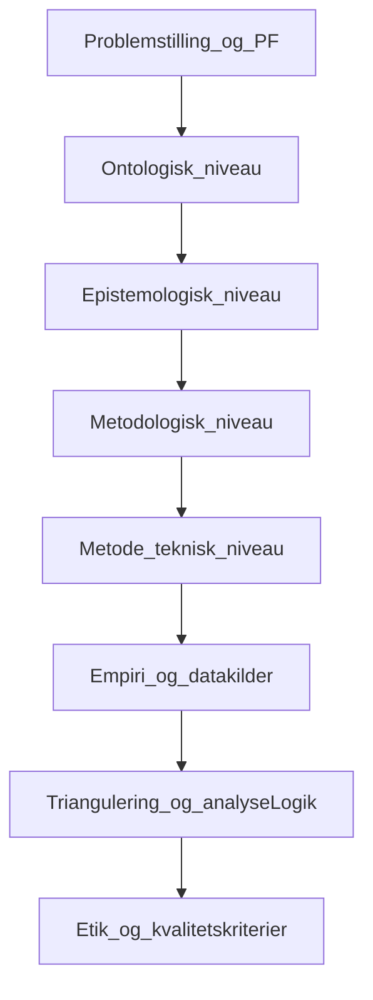

# Indholdsfortegnelse: Videnskabsteori-eksamen (synopsis) - Luka

Formaalet med denne version er at give en eksamensklar synopsisstruktur, der er konsistent med undervisningens krav (Salling-struktur), de fire vidensniveauer, vejlederfeedback og caseafgraensning.

## 1. Indledning / problemstilling
Kort problemramme for casen: hvorfor spildtid i bemandingsprocessen er fagligt relevant, og hvorfor samspillet mellem AI-forslag og manuelle beslutninger er en videnskabsteoretisk interessant problemstilling.

## 2. Problemformulering og afgraensning
Dette afsnit skal gengive den faelles problemformulering og de fire delspoergsmaal ordret og derefter indramme din individuelle synopsisvinkel.

### Faelles problemformulering (gruppe)
Hvordan paavirker AI-baseret automatisering spildtid i bemandingsprocessen fra modtaget opgave til klientindstillet konsulent hos Support Solutions ApS, og hvilke forudsaetninger kraever reduktion af de resterende manuelle procestrin?

### Delspoergsmaal (gruppe)
1. Hvor i workflowet opstaar de stoerste former for ventetid og processpild?
2. Hvilke trin er automatiseret i SoluTalent, og hvilke forbliver manuelle?
3. Hvilke KPI-spor kan belyse mulige flaskehalse, rework og beslutningsforsinkelse?
4. Hvilke forudsaetninger skal vaere opfyldt for at reducere de manuelle trin?

### Afgraensning (synopsisrelevant)
- SoluTalent-proces: fra modtaget opgave til klientindstillet konsulent (funktionelt `staging_imported` -> `matched`)
- Post-match administration (kontrakt, fakturering, onboarding m.m.) er ude af scope
- Fokus er funktionel analyse af research design og metodevalg (ikke ML-arkitektur)

### Individuel vinkel (Luka)
Afslut afsnit 2 med 3-5 linjer, der tydeligt siger hvad du som individuel eksaminand vil forsvare i afsnit 3-5:
- hvordan du begrunder pragmatisk design for netop denne PF
- hvordan du afgraenser indlejret case organisatorisk
- hvordan du bruger triangulering som argumentationslogik

## 3. Redegoerelse for research design (fire vidensniveauer)
Hovedafsnittet skal vise kongruens fra videnskabsteori til metode.

### 3.1 Videnskabsteoretisk position: pragmatisme
Kort begrundelse for pragmatisme i relation til PF: projektet skal rumme baade observerbare procesforhold og fortolkede organisatoriske praksisser.
Skriv det som din egen, individuelle begrundelse (ikke gruppens generelle tekst).

### 3.2 Ontologi
Kort begrebsdefinition og anvendelse paa casen: hvad antages at "eksistere" i undersoegelsen (systemiske spor og sociale fortolkninger), og hvordan det relaterer til problemets karakter.
Tilfoej en kort passus om hvordan dette valg styrer din efterfoelgende metodeargumentation.

### 3.3 Epistemologi
Adskilt underafsnit (ikke blandet med ontologi): fortolkende epistemologi (interpretivisme, moderne hermeneutik) over for den del af undersoegelsen, der benytter klassisk positivistisk inspirerede processpor.
Afslut med 2-3 linjer om hvordan du personligt vil forsvare kombinationen mundtligt over for Jens.

### 3.4 Metodologi: slutningsform, design og case
Abduktion, sekventielt udforskende design og indlejret single-case.
Indlejret case skal begrundes som delmaengde af organisationen (afdeling/team), ikke som workflow-trin i sig selv.
Lav en individuel formulering af hvorfor dette casevalg er fagligt bedre end et holistisk casevalg i din kontekst.

### 3.5 Metode og triangulering
Kort om datakilder (interview, artefakt, platformspor) og deres analytiske funktion.
Triangulering forklares som redskab til at synliggoere spaendet mellem formelle principper og faktisk beslutningsadfaerd (ikke som ren opremsning).
Skriv eksplicit hvilken kilde der har primaer forklaringsrolle, og hvilken der har valideringsrolle i din analyse.

### 3.6 Tidshorisont og kvantitativ repraesentativitet
Defineres som tvaersnitslogik for den valgte periode/population.
Klar markering af hvad data kan sige noget om, og hvad den ikke kan.
Tilfoej konkret periode i din synopsisversion (indsat i parentes ved aflevering).

## 4. Empiri (oversigt)
Kort overblik over informanttyper, dokumenter og platformspor, og hvorfor disse er relevante for de metodiske valg i synopsen.
Hold afsnittet paa principniveau, saa synopsis ikke bliver til et fuldt metodekapitel.

## 5. Etik (aksiologi) og kvalitetskriterier
Eksplicit etikafsnit med:
- Credibility (inkl. informantvalidering)
- Transferability
- Dependability
- Confirmability
- Kvantitative kvalitetskrav: maalepaalidelighed, stabilitet, repraesentativitet
- Insider-bias og hvordan kritisk distance sikres
Afslut med 2-3 linjer om hvilke konkrete arbejdsgange du vil bruge for at undgaa confirmation bias.

## 6. Redegørelse for research design: figur (fire vidensniveauer)

### Fuld afsnitstekst (udkast — kopiér til synopsis)

Afsnittet her samler research designet i **én oversigtsfigur**, der følger undervisningens opdeling i **fire vidensniveauer**: ontologisk, epistemologisk, metodologisk og metode-/teknisk. Den detaljerede begrundelse af hvert niveau og af problemformuleringens kobling til metodevalg er udfoldet i afsnit 3; figuren fungerer som **visuelt strukturbevis** på, at valgene hænger sammen fra filosofi over tilgang og design til konkret dataindsamling og analyse.

Figuren er opbygget efter samme logik som vejlederen beskriver for redegørelsen: man kan forklare **begreberne evidensmæssigt** — fx ontologi med udgangspunkt i **Kuada** (2012), derefter fortolkning i **denne** case — og vise, hvordan **pragmatisme** begrundes ud fra problemformuleringen med **to perspektiver** jævnfør **Rossman & Wilson** (1985). Visuelt viser øverste del derfor pragmatisme med spor til henholdsvis positivistisk og interpretivistisk inspireret viden om proces og praksis. **Abduktion** (Holm, 2023) angiver slutningsformen. Under research design fremgår **eksplorativ** tilgang, **indlejret case** om en organisatorisk delmængde hos Support Solutions ApS med empirisk fokus på matching i SoluTalent, **tværsnit** i en defineret periode, og **multi-method** indsamling med primære data (semistrukturerede interviews), sekundære kilder efter behov og systemiske spor fra platformen. **Triangulering** placeres som samlende logik mellem kilderne, så forskellen mellem formelle systemprincipper og faktisk beslutningsadfærd kan belyses. Analyse og diskussion afslutter kæden. Afgrænsningen følger processen fra modtaget opgave til klientindstillet konsulent; post-match forhold indgår ikke.

Har indholdsfortegnelsen allerede **ontologisk, epistemologisk, metodologisk og metode-/teknisk valg** som underoverskrifter i redegørelsen, behøver den **ikke** at referere særskilt til figuren — jf. vejledning om, at redegørelsen kan bære figuren uden ekstra TOC-punkt.

*[Indsæt figur her: tilpasset `image28.png` eller `docs/figures/RESEARCH_STRUCTURE_SYNOPSIS_LUKA.svg`]*

**Figur 1.** Oversigt over research structure for bachelorprojektet om AI-baseret automatisering og spildtid i bemandingsprocessen hos Support Solutions ApS (SoluTalent-processen fra modtaget opgave til klientindstillet konsulent; funktionelt `staging_imported` → `matched`). Figuren visualiserer den fire-delte vidensniveau-struktur og den efterfølgende empiri- og trianguleringslogik. Begrebsmæssig forankring: Kuada (2012); pragmatisk strategi og perspektiver: Rossman & Wilson (1985); slutningsform: Holm (2023); design og datatyper: Saunders et al. (2023). *Egen tilpasning efter undervisningens skabelon.*

---

**Vejleder (saif7) — intern checkliste:** Research design er opdelt i **fire vidensniveauer**: ontologisk, epistemologisk, metodologisk og metode-/teknisk — så man kan se, hvilke elementer der ligger i det. Afsnittet kan hedde **«Redegørelse for research design»**, **«Research design»** eller **«Metodologiske valg»**; underoverskrifter i **indholdsfortegnelsen** kan være ontologisk valg, epistemologisk valg, metodologisk valg og metode-/teknisk valg. **Har I en redegørelse, behøver I ikke have referencer i indholdsfortegnelsen til selve figuren.** De små ekstra niveauer skal ikke med i indholdsfortegnelsen, så den ikke bliver for meget.

**I redegørelsen** (ikke i indholdsfortegnelsen) følger I beviskæden: *Hvad er ontologi?* med citat/parafrase fra **Kuada**, derefter fortolkning og hvad det betyder i jeres kontekst; *pragmatisme* og anvendelse ud fra **problemformuleringen** med **to perspektiver** jævnfør **Rossman & Wilson**; derefter problemformuleringens delelementer. Samme logik i epistemologi med underafsnit om positivistisk vs. interpretivistisk epistemologi efter behov.

---

### Figur (fils til aflevering)

| Kilde | Sti |
|---|---|
| Undervisning / B&O-skabelon (tilpas tekst til SS, ikke B&O) | [`pptx_extract/content/ppt/media/image28.png`](../pptx_extract/content/ppt/media/image28.png) |
| Egen forenklet kongruenskæde (SVG) | [`docs/figures/RESEARCH_STRUCTURE_SYNOPSIS_LUKA.svg`](figures/RESEARCH_STRUCTURE_SYNOPSIS_LUKA.svg) |
| Lagdiagram (alternativ) | [`pptx_extract/content/ppt/media/image20.png`](../pptx_extract/content/ppt/media/image20.png) |

Indsæt valgt figur i Word/PDF. Ved **image28**: ret case-tekst, antal interviews og sekundære kilder, så det matcher jeres projekt.

---

### ASCII-oversigt (samme struktur)

```
RESEARCH PHILOSOPHY          PRAGMATISM
    |                    /            \
    |            POSITIVISM        INTERPRETIVISM
    |                    \            /
    v                          v
RESEARCH APPROACH         ABDUCTION
    v
RESEARCH DESIGN           EXPLORATORY -> CASE STUDY (SS / indlejret org.)
              +            CROSS-SECTIONAL (periode)
              +            MULTI-METHOD -> PRIMARY | TRIANGULATION | SECONDARY
    v
ANALYSIS -> DISCUSSION
(Etik/kvalitet: kort i redegørelsen, ca. 1/4-1/2 side — jf. vejleder)
```

---



## 7. Foreloebig disposition (bachelorrapport)
Kort, foreloebigt overblik over hvordan bachelorrapporten senere udfolder PF, uden at synopsis bliver til et fuldt metodekapitel.

## 8. Litteraturliste (foreloebig)
Tier 1-kilder foerst, kun kilder der faktisk anvendes i synopsen.

Foreslaaet kerne:
- Holm (2023)
- Kuada (2012)
- Saunders et al. (2023)
- Rossman and Wilson (1985)

---

## Mundtlig forberedelse: 10 hurtige som primær traening
Brug underviserens "10 hurtige pa 10 minutter" som primær eksamensforberedelse.

Konkrete loops:
1. Koer saet A uden noter (10 min)
2. Ret med noter og marker svage begreber (10-15 min)
3. Koer samme saet igen dagen efter (10 min)
4. Gentag med saet B/C

Maal:
- Kunne definere begreber kort og korrekt
- Kunne koble hvert begreb til jeres case paa 1-2 saetninger
- Kunne forklare hvorfor jeres valg er kongruente med PF
