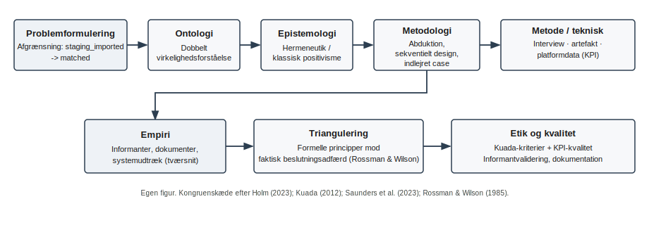

# Synopsis — Theory of Science (videnskabsteori) — Luka Christian Wigø

**Emne:** AI-automatisering og spildtid i bemandingsprocessen — Support Solutions ApS / SoluTalent  
**Afgrænsning:** `staging_imported` → `matched`

---

## 1. Indledning

**Makroniveau (branchekontekst):**  
Det skandinaviske marked for specialiserede IT-kompetencer er præget af højt tempo og hård konkurrence, hvor hurtig mobilisering af talent er en central performancefaktor (Ework Group, 2026). Samtidig peger arbejdsmarkedsdata på, at kapacitetsudnyttelse og tidsanvendelse er afgørende for organisationers evne til at omsætte efterspørgsel til leverancer (Danmarks Statistik, n.d.). I denne kontekst bliver gennemløbstid i bemandingsprocesser ikke kun et internt driftsforhold, men et strategisk konkurrencevilkår.

**Mesoniveau (organisationskontekst):**  
Support Solutions ApS positionerer sig på hurtig levering af kandidatforslag, hvilket gør proceshastighed til et eksplicit forretningskrav (Support Solutions, n.d.). SoluTalent fungerer her som den operationelle platform, hvor automatiserede forslag og manuelle vurderinger kombineres i det daglige matchingarbejde (SoluTalent, n.d.). Netop denne kombination skaber et relevant analysefelt, fordi den både rummer potentiale for effektivisering og risiko for nye flaskehalse.

**Mikroniveau (konkret problem):**  
I den konkrete proces fra registreret opgave til klientindstillet konsulent opstår der beslutningsled, hvor manuelle reviews, overstyringer og gentagne loops kan reproducere ventetid. Problemet er derfor ikke et generelt “virker AI?”-spørgsmål, men hvordan samspillet mellem systemlogik og organisatorisk praksis påvirker spildtid i et afgrænset workflow.

**Forskningsgab og synopsisformål:**  
Der mangler en videnskabsteoretisk og metodisk begrundet ramme, som kan analysere både målbare procesmønstre og de fortolkninger, der styrer faktisk beslutningsadfærd i organisationen. Denne synopsis opstiller derfor et kongruent research design, der afgrænses til SoluTalent-processen `staging_imported` → `matched`, og som begrunder valg af videnskabsteoretisk position, metodologi, empiri og kvalitetskriterier i tråd med pensum (Kuada, 2012; Holm, 2023; Saunders et al., 2023; Rossman & Wilson, 1985).

---

## 2. Problemformulering og afgrænsning

På baggrund af den identificerede spænding mellem krav om hurtig levering og behov for kvalitet i matchingprocessen undersøger denne synopsis følgende:

**Problemformulering**  
Hvordan påvirker AI-baseret automatisering spildtid i bemandingsprocessen fra modtaget opgave til klientindstillet konsulent hos Support Solutions ApS, og hvilke forudsætninger kræver reduktion af de resterende manuelle procestrin?

**Delspørgsmål**  
1. Hvor i workflowet opstår de største former for ventetid og processpild?  
2. Hvilke trin er automatiseret i SoluTalent, og hvilke forbliver manuelle?  
3. Hvilke KPI-spor kan belyse mulige flaskehalse, rework og beslutningsforsinkelse?  
4. Hvilke forudsætninger skal være opfyldt for at reducere de manuelle trin?

### 2.1 Afgrænsning

Undersøgelsen afgrænses til den systemunderstøttede del af bemandingsprocessen i SoluTalent fra `staging_imported` til `matched`. Det betyder, at aktiviteter før registrering i systemet samt post-match aktiviteter (fx kontrakt, onboarding, fakturering og øvrig administration) ikke indgår i analysens kernefelt.

Afgrænsningen er valgt for at sikre metodisk kongruens mellem problemformulering, empiri og analyse, så undersøgelsen fokuserer på den del af processen, hvor samspillet mellem automatiserede forslag og manuelle beslutninger kan vurderes mest direkte.

Projektet gennemføres som funktionel og procesorienteret analyse. Fokus er derfor på organisatorisk beslutningsadfærd, procesflow og dokumenterbare mønstre i workflowet — ikke på teknisk evaluering af ML-arkitektur eller modeltræning.

### 2.2 Synopsisens analytiske sigte

I tråd med undervisningens research design-logik og den oversigtsfigur, der afsluttes i afsnit 6 (ontologi → epistemologi → metodologi → metode/teknisk niveau), fungerer denne problemafgrænsning som styrende præmis for de følgende afsnit. Formålet er at etablere et videnskabsteoretisk robust grundlag, hvor metodevalg og datagrundlag følger problemet — ikke omvendt (Holm, 2023; Saunders et al., 2023; Kuada, 2012; Rossman & Wilson, 1985).

---

## 3. Redegørelse for research design

Undersøgelsen retter sig mod den systemunderstøttede del af bemandingsprocessen i SoluTalent fra `staging_imported` til `matched`. Post-match aktiviteter indgår ikke. Analysen er funktionel og procesorienteret; teknisk ML-udvikling og modelarkitektur ligger uden for scope.

### 3.1 Videnskabsteoretisk position: pragmatisme

Projektet anlægger en pragmatisk position, fordi problemformuleringen kræver både dokumenterbare forhold i et workflow og fortolkning af beslutningspraksis i organisationen. Valget begrundes ud fra problemets karakter og kravet om anvendt viden i en konkret case (Kuada, 2012; Saunders et al., 2023).

Den pragmatiske kombination af kvalitative og kvantitative spor begrundes strategisk med Rossman og Wilson (1985), fordi deres ramme forklarer, hvordan forskellige datatyper kan indgå i samme undersøgelse med tydelige roller. Kuada (2012) anvendes til begrebsforankring og metodeforståelse; Rossman og Wilson (1985) bærer begrundelsen for den konkrete kombination af spor i dette projekt.

### 3.2 Ontologi

Ontologi defineres som spørgsmålet om eksistens og genstandsfelt for undersøgelsen (Kuada, 2012). I denne case forudsættes, at både systemiske hændelser og organisatorisk praksis er relevante: platformen efterlader spor i form af states, tidslige mønstre og beslutningshændelser, mens medarbejdernes vurderinger og fortolkninger udgør en social og meningsbåret dimension (Holm, 2023).

Denne dobbelthed beskrives med Rossman og Wilson (1985) som en dobbelt virkelighedsforståelse: et spor knyttet til observerbare processer og et spor knyttet til fortolket praksis. Ontologien retter sig mod genstandsfeltet som både systemisk og socialt, men uden at gøre tekniske workflow-begreber til selvstændigt ontologisk hovedpunkt i synopsen.

### 3.3 Epistemologi

Epistemologi behandles som spørgsmålet om, hvordan viden kan skabes om genstandsfeltet (Kuada, 2012).

Det fortolkende spor knyttes til interpretivisme og moderne hermeneutik. Semistrukturerede interviews anvendes til at belyse begrundelser, fortolkninger og handlingslogik — fx omkring overstyringer, risiko og vurdering af match-kvalitet (Holm, 2023; Saunders et al., 2023).

Det spor, der bygger på platformdata og KPI, behandles som **positivistisk inspireret**: fokus er på observerbare og sammenlignelige mønstre i det afgrænsede workflow uden at forpligte undersøgelsen til en snæver, historisk positivistisk programmatik (Holm, 2023; Saunders et al., 2023).

Det positivistisk inspirerede spor placeres under systemdata og KPI. Fortolkende epistemologi placeres under interviewsporet. De to spor kombineres under den overordnede pragmatiske ramme, men holdes begrebsligt adskilt i redegørelsen, så fortolkende position ikke blandes sammen med KPI-delen i samme underoverskrift.

### 3.4 Metodologi: slutningsform, design og case

Slutningsformen er abduktiv (Holm, 2023): observationer i data og interviews sættes i dialog med teoretiske rammer om spild og organisatoriske forudsætninger, og forklaringer justeres, når empiriske mønstre ikke stemmer med foreløbige antagelser.

Designet er sekventielt udforskende: der indsamles først kvalitative data og derefter kvantitative spor i en rækkefølge, der understøtter metodetriangulering (Saunders et al., 2023).

Casen er et indlejret single-case studie (Holm, 2023). Indlejret betyder, at undersøgelsen afgrænses til en del af organisationen — den del, der arbejder med matching i SoluTalent — frem for hele virksomheden. SoluTalent er den konkrete proces, der studeres inden for den organisatoriske afgrænsning, ikke selve definitionen på “indlejret case”.

### 3.5 Metode og triangulering

Empirien kombinerer semistrukturerede interviews, artefaktanalyse af beslutningsflow i platformen og systemiske dataudtræk med KPI, der er defineret i en måleplan.

Triangulering forklares ikke som en liste af metoder. Den skal kunne vise forskellen mellem formelle principper i systemets logik og faktisk beslutningsadfærd i praksis (Rossman & Wilson, 1985). I et sekventielt udforskende design understøttes metodetriangulering af rækkefølgen i dataindsamlingen (Saunders et al., 2023). Kuada (2012) anvendes til at understøtte forståelsen af triangulering som metodeprincip, mens Rossman og Wilson (1985) bærer den strategiske begrundelse.

### 3.6 Tidshorisont og kvantitativ repræsentativitet

Den kvantitative del beskrives som tværsnit: data indsamles i en angivet periode og på tværs af den relevante gruppe i casen, så mønstre kan sammenholdes inden for samme ramme (Saunders et al., 2023). Resultaterne fortolkes som gyldige for den afgrænsede kontekst og periode, ikke som generelle påstande om hele branchen.

---

## 4. Empiri (oversigt)

Empirien er tredelt og følger den pragmatiske kombination af fortolkende og dokumenterbare spor, som research designet i afsnit 3 begrunder.

Semistrukturerede interviews indsamles som primære kvalitative data. Informanter udvælges med purposive sampling (Saunders et al., 2023) med henblik på at dække roller, der har strategisk, teknisk og operativ indsigt i matchingprocessen og beslutninger omkring SoluTalent — typisk 4–6 interviews, afhængigt af adgang og datamætning. Interviewene skal belyse begrundelser for manuelle trin, overstyringer og organisatoriske hensyn, som ikke fremgår direkte af systemlog.

Artefaktanalyse anvendes til at kortlægge det aktuelle beslutningsflow i platformen: hvilke trin der er automatiserede, hvor manuelle gates opstår, og hvordan proceslogikken er udformet i praksis. Artefakterne fungerer som en uafhængig kilde til at beskrive “formelle principper” i systemet, som efterfølgende kan sammenholdes med interviews og dataudtræk.

Systemiske data og KPI hentes fra definerede udtræk i SoluTalent i den periode, der er angivet som tværsnit i afsnit 3.6. Indikatorerne understøtter identifikation af ventetid, gentagne gennemløb, beslutningsforsinkelse og mønstre i overstyringer og afvisninger. Dataene bruges til at beskrive observerbare mønstre i det afgrænsede workflow fra `staging_imported` til `matched`, ikke til at dokumentere forhold uden for denne proces.

De tre empirikilder samles i trianguleringen, så interviews forklarer og nuancerer, artefakt fastlægger systemets intentionelle logik, og platformdata viser faktiske forløb. Kombinationen er valgt, fordi ingen enkelt kilde alene kan besvare problemformuleringen om spildtid og manuelle procestrin i samspillet mellem AI-forslag og organisatorisk praksis (Rossman & Wilson, 1985).

---

## 5. Etik (aksiologi) og kvalitetskriterier

Undersøgelsen involverer personer og virksomhedsdata og kræver derfor eksplicit etisk stillingtagen. Aksiologisk vurderes forskningen ud fra, hvilke værdier der prioriteres i designet: gennemsigtighed, respekt for informanters autonomi og ansvarlig omgang med data (Kuada, 2012). Samtykke, information om formål og mulighed for at trække sig indgår i den praktiske etiske procedure og følger organisationens og persondatalovgivningens rammer.

### 5.1 Kvalitative kvalitetskriterier

Kvalitative kriterier følger Lincoln og Gubas ramme, som Kuada (2012) beskriver.

**Credibility** sikres ved, at centrale interviewfortolkninger kan støttes af andre kilder (triangulering). Derudover anvendes **informantvalidering**: udvalgte analyseresultater og fortolkninger sendes tilbage til informanten med angivelse af den kontekst, de skal bruges i, så informanten kan bekræfte, afvise eller rette (Kuada, 2012).

**Transferability** sikres ved en tilstrækkeligt tydelig kontekstbeskrivelse af casen og afgrænsningen af processen i SoluTalent, så en læser kan vurdere overførbarhed til andre situationer (Kuada, 2012).

**Dependability** sikres ved sporbar dokumentation: interviewguide, noter fra dataindsamling, beslutninger om kodning og ændringer undervejs, så analysen kan følges udefra (Kuada, 2012).

**Confirmability** sikres ved, at konklusioner kan spores til empiriske observationer og dokumentation, og at fortolkninger ikke præsenteres som neutrale fakta uden at vise datagrundlaget (Kuada, 2012).

### 5.2 Kvantitative kvalitetskriterier

De kvantitative spor vurderes med fokus på **målepålidelighed** (klare definitioner af KPI og konsistent udtræk), **stabilitet** over den valgte periode (sammenlignelighed inden for tværsnittet) og **repræsentativitet** inden for den afgrænsede population af sager og det valgte tidsrum (Saunders et al., 2023).

### 5.3 Insider-position og bias

Forfatteren har insider-adgang gennem praktik og kendskab til udviklingen af SoluTalent. Det giver empirisk nærhed, men øger risiko for bekræftelsesbias. Det imødegås ved at behandle negative indikatorer (fx høj override rate, gentagne afvisninger, lange beslutningsforløb) som analytisk lige så centrale som positive mønstre, og ved at lade artefakt og platformdata fungere som kilder, der kan udfordre interviewfortolkninger (Rossman & Wilson, 1985).

---

## 6. Redegørelse for research design: oversigtsfigur

Afsnittet samler research designet i **én oversigtsfigur**, der følger undervisningens opdeling i **fire vidensniveauer**: ontologisk, epistemologisk, metodologisk og metode-/teknisk. Den detaljerede begrundelse er udfoldet i afsnit 3; figuren er et **strukturbevis** på kongruens fra filosofi over tilgang og design til dataindsamling og analyse.

Figuren følger samme logik som i redegørelsen: begreber forankres med **Kuada** (2012), fortolkes i casens kontekst, og **pragmatisme** begrundes ud fra problemformuleringen med **to perspektiver** jævnfør **Rossman & Wilson** (1985). Visuelt vises pragmatisme med spor til positivistisk inspireret viden om procesmønstre og interpretivistisk inspireret viden om praksis; **abduktion** (Holm, 2023); eksplorativt design; indlejret case om organisatorisk delmængde hos Support Solutions ApS med fokus på matching i SoluTalent; tværsnit; multi-method indsamling; triangulering; analyse og diskussion. Ved aflevering i Word/PDF indsættes figuren som vektor- eller højopløsningsgrafik; nedenfor følger den tilhørende SVG-fil fra projektrepo som reference.

**Figur 1.** Oversigt over research structure for bachelorprojektet om AI-baseret automatisering og spildtid i bemandingsprocessen hos Support Solutions ApS (SoluTalent: `staging_imported` → `matched`). Figuren visualiserer den fire-delte vidensniveau-struktur og den efterfølgende empiri- og trianguleringslogik. Begrebsmæssig forankring: Kuada (2012); pragmatisk strategi og perspektiver: Rossman & Wilson (1985); slutningsform: Holm (2023); design og datatyper: Saunders et al. (2023). *Egen tilpasning efter undervisningens research-structure-skabelon.*

---

## 7. Foreløbig disposition (bachelorrapport)

1. Indledning og problemfelt  
2. Problemformulering, delspørgsmål og afgrænsning  
3. Teoretisk ramme (Lean, TOE, DSS m.v. — i tråd med bachelorens analysebehov)  
4. Metode og research design (udfoldning af synopsis med operationalisering og måleplan)  
5. Analyse (struktureret efter delspørgsmål)  
6. Diskussion  
7. Konklusion  
8. Litteraturliste og bilag (interviewguide, samtykke, udtræksdefinitioner efter behov)

---

## 8. Litteraturliste (Harvard)

Danmarks Statistik. (n.d.). *Beskæftigelse og arbejdsløshed*. https://www.dst.dk/ (tilgået 24. marts 2026).

Ework Group. (2026). *Ework market analysis 2030: top three market trends unveiled*. https://www.eworkgroup.com/ (tilgået 24. marts 2026).

Holm, A. B. (2023). *Videnskab i virkeligheden – En grundbog i videnskabsteori* (3. udg.). Samfundslitteratur.

Kuada, J. (2012). *Research Methodology: A Project Guide for University Students*. Samfundslitteratur.

Rossman, G. B. & Wilson, B. L. (1985). Numbers and Words: Combining Quantitative and Qualitative Methods in a Single Large-Scale Study. *Evaluation Review*, 9(5), 627–643.

Saunders, M. N. K., Lewis, P. & Thornhill, A. (2023). *Research Methods for Business Students* (9. udg.). Pearson.

SoluTalent. (n.d.). *SoluTalent – Premium Global Freelancers*. https://solutalent.com/ (tilgået 24. marts 2026).

Support Solutions. (n.d.). *IT Konsulenter – første CV inden 48 timer*. https://support-solutions.dk/ (tilgået 24. marts 2026).

---

*Synopsis udarbejdet til Theory of Science-eksamen / forberedelse af bachelorprojekt. Navn: Luka Christian Wigø.*
