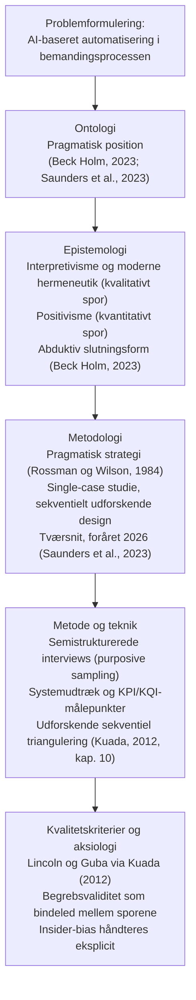

# Synopsis — Theory of Science (videnskabsteori)

### AI-baseret automatisering i bemandingsprocessen for indstilling af konsulenter hos Support Solutions ApS

*Procesafgrænsning: Bemandingsprocessen for indstilling af konsulenter til klienters IT-projekter*

 

|                        |                                                                 |
| ---------------------- | --------------------------------------------------------------- |
| **Forfatter**          | Luka Christian Wigø                                             |
| **Uddannelse**         | BA i Business Economics and IT, 7. semester                     |
| **Institution**        | Erhvervsakademi København (KEA)                                 |
| **Vejleder**           | Jens Andersen                                                   |
| **Afleveringsdato**    | 21. april 2026                                                  |

---

## Indholdsfortegnelse

1. **Indledning**
2. **Problemanalyse**
3. **Problemformulering og afgrænsning**
4. **Metodologi og research design**
   - 4.1 &nbsp;Ontologisk ståsted
   - 4.2 &nbsp;Epistemologisk ståsted
   - 4.3 &nbsp;Metodologisk ramme
   - 4.4 &nbsp;Forskningsdesign, case og tidshorisont
   - 4.5 &nbsp;Metode og teknik
5. **Empiri, etik og kvalitetskriterier**
   - 5.1 &nbsp;Empirigrundlag
   - 5.2 &nbsp;Tværsnitsundersøgelse
   - 5.3 &nbsp;Etik og kvalitetskriterier
   - 5.4 &nbsp;Insider-position og bias
6. **Oversigt over research design**
7. **Litteraturliste**
8. **Bilag**

> **Figuroversigt:** Figur 1, afsnit 6.
> **Bilagsoversigt:** Bilag A–C (forundersøgelsesinterviews).

---

## 1. Indledning

Leverandører i det danske marked for IT-konsulentydelser positionerer sig typisk på hurtig respons og dokumenteret kvalitet i udvælgelsen af specialister (Right People Group, n.d.; Support Solutions, n.d.). Internationale platforme som Upwork og Fiverr understøtter matching via digitale anbefalingssystemer (Upwork, n.d.; Fiverr, n.d.), og Support Solutions' bemandingsproces udgør en afgrænset dansk variant af denne tendens.

Support Solutions ApS er et dansk konsulentbureau, der indstiller IT-specialister til klienters IT-projekter, fx systemoptimering, IT-support og projektledelse (Support Solutions, n.d.). Kerneforretningen består i at matche den rette konsulent med et konkret projekt, og hurtig fremdrift fremhæves som central værdiproposition.

Indstillingsprocessen understøttes af platformen SoluTalent, hvor en algoritme rangerer konsulentprofiler ud fra kompetence-, erfarings- og opgavedata (SoluTalent, n.d.; bilag B). Med AI-baseret automatisering menes netop denne algoritmiske rangering, som medarbejderne efterfølgende vurderer, accepterer, afviser eller overstyrer inden indstilling. Platformen fungerer dermed som et beslutningsstøttesystem (DSS), hvor den endelige vurdering hviler på forhold, som systemdata ikke fuldt ud kan afspejle (bilag A).

Formålet med synopsen er at opstille et videnskabsteoretisk kongruent research design, der kan bære en senere undersøgelse af problemformuleringen.

---

## 2. Problemanalyse

Bemandingsprocessen hos Support Solutions udgør bindeleddet mellem klienters konkrete IT-opgaver og virksomhedens konsulentnetværk. Tre forundersøgelsesinterviews med Informant 1 (ledelse), Informant 2 (teknisk ansvarlig) og Informant 3 (ledelse) peger samstemmende på, at kerneudfordringen ikke er mangel på kandidater, men kvaliteten og konsistensen af selve udvælgelses- og beslutningsprocessen (bilag A; B; C).

Udvælgelsen af konsulenter hviler på en kombination af kvantitative og kvalitative kriterier. På den kvantitative side indgår KPI'er (Key Performance Indicators), der måler proceseffektivitet. Det drejer sig om behandlingstid fra modtaget opgave til klientindstilling, antal gentagne vurderinger af samme profil og override-rate, dvs. hvor ofte systemets anbefalinger tilsidesættes af medarbejderen (bilag A; B). På den kvalitative side anvendes KQI'er (Key Quality Indicators) om forhold som matchkvalitet, vurderingskonsistens på tværs af medarbejdere og kvaliteten af profilgrundlaget. KQI'erne kalibreres mod ekstern klientfeedback, som modtages skriftligt efter afsluttet indstilling og fungerer som uafhængig kontrolkilde til medarbejdernes matchvurdering (bilag A; C).

Ineffektiviteten knytter sig i overvejende grad til de manuelle beslutningsled og ikke til selve rangeringen i systemet. Interviewene viser, at beslutninger kan *"blive liggende lidt for længe"* (bilag A), at processen kan *"gå i stå i de manuelle led"* (bilag B), og at systemet *"peger, men ikke beslutter"* (bilag B). Der registreres desuden variation i medarbejdernes vurderinger (bilag A; C), og kvalitet vægtes højere end hastighed i den endelige indstilling (bilag A; C).

Nyere analyser peger på, at AI generelt fungerer som støtte frem for erstatning af beslutningsprocesser (McKinsey & Company, 2023, 2024, 2025; Deloitte, 2024), hvilket stemmer overens med bemandingsprocessen, hvor den endelige beslutning fortsat afhænger af menneskelig vurdering. Arbejdsdelingen mellem algoritmisk rangering og menneskelig vurdering betyder, at hverken hastighed eller matchkvalitet kan prioriteres isoleret. En forsvarlig automatisering forudsætter derfor, at beslutningslogikken i de manuelle led først er afdækket empirisk.

---

## 3. Problemformulering og afgrænsning

### Problemformulering

> **Hvordan kan Support Solutions ApS implementere AI-baseret automatisering i bemandingsprocessen for indstilling af konsulenter til løsning af deres klienters IT-projekter?**

Formuleringen er bevidst åben og undersøgende. Ved AI-baseret automatisering forstås algoritmisk rangering af konsulentprofiler i SoluTalent, som medarbejderne efterfølgende vurderer, accepterer, afviser eller overstyrer inden indstilling. Målet er kontekstuel og anvendelsesorienteret indsigt, ikke påvisning af en generel kausal effekt. Analysen retter sig mod, hvordan udvælgelsesprocessen, det tilgængelige målegrundlag (KPI'er og KQI'er) og de organisatoriske rammer for human-in-the-loop tilsammen former mulighederne for en forsvarlig implementering.

### Afgrænsning

Undersøgelsen afgrænses til bemandingsprocessen i SoluTalent, fra en opgave er registreret i platformen, til en konsulent er klientindstillet. Platformen behandles som organisatorisk artefakt og ikke som genstand for teknisk evaluering af maskinlæringsmodeller. Aktiviteter før registrering (jobsourcing, leadhåndtering) og efter matching (kontrakt, løn, onboarding, fakturering) samt komparativ analyse af andre platforme ligger uden for scope. Fokus er arbejdsdelingen mellem menneske og system og de dokumenterbare mønstre i beslutningsadfærden. Den kvantitative del gennemføres som tværsnitsundersøgelse i et afgrænset observationsvindue i foråret 2026.

Forskningsbidraget ligger ikke i en anbefaling om yderligere automatisering, men i en analytisk belysning af, hvilke organisatoriske og datamæssige forudsætninger der skal være opfyldt, for at en algoritmisk matchproces kan integreres forsvarligt i en praksis med human-in-the-loop. Generaliseringen er analytisk til teori om beslutningsstøtte (Beck Holm, 2023).

---

## 4. Metodologi og research design

Research designet struktureres i fire vidensniveauer: ontologisk, epistemologisk, metodologisk og metode- og teknisk. Pointen er, at konkrete metodevalg følger problemets karakter og afgrænsning, ikke omvendt (Kuada, 2012; Saunders et al., 2023).

### 4.1 Ontologisk ståsted

Ontologi forstås som spørgsmålet om, hvad der antages at eksistere inden for undersøgelsens genstandsfelt (Kuada, 2012; Beck Holm, 2023). Genstandsfeltet omfatter både observerbare forhold i SoluTalents procesforløb, såsom tidsstempler, beslutningsknudepunkter og overstyringer, og en organisatorisk praksis, hvor medarbejdere vurderer matchkvalitet, håndterer usikkerhed og afvejer risiko. Platformen er et værktøj og ikke selve undersøgelsesobjektet.

Undersøgelsen placerer sig ontologisk i en pragmatisk position: feltet er tilstrækkeligt stabilt til at efterlade observerbare spor, men beskrivelserne af processen formes af de begreber og spørgsmål, der gør dem brugbare (Beck Holm, 2023; Saunders et al., 2023). Systemets registrerede tilstande og aktørernes vurderinger behandles som to sider af samme felt, der undersøges parallelt uden at reduceres til hinanden.

Valget af pragmatisk ontologi peger frem mod et tilsvarende pragmatisk strategivalg på metodologi-niveau (Rossman og Wilson, 1984, jf. afsnit 4.3).

### 4.2 Epistemologisk ståsted

Epistemologi behandler, hvordan gyldig viden om genstandsfeltet kan etableres. Interviewsporet placeres inden for interpretivisme og moderne hermeneutik, fordi aktørernes begrundelser og beslutningslogik kun kan forstås i kontekst (Beck Holm, 2023; Saunders et al., 2023). Forskerens forforståelse, her formet af insider-position og teknisk kendskab til platformen, bringes eksplicit i spil og justeres i en cirkulær bevægelse mellem del og helhed, hvor enkelte informantudsagn og den samlede bemandingsproces gensidigt reviderer hinanden.

Udtræk fra systemet og definerede målepunkter udgør derimod et kvantitativt målespor inden for en positivistisk epistemologi, hvor viden etableres gennem observerbare og målbare spor (Beck Holm, 2023). De to spor kombineres inden for den pragmatiske ramme, men holdes begrebsmæssigt adskilt.

Slutningsformen er abduktiv: forklaringer udvikles, når empiriske mønstre overrasker den eksisterende forståelse, og afprøves mod teori i en løbende vekselvirkning mellem empiri og begreber (Beck Holm, 2023).

### 4.3 Metodologisk ramme

Projektet anlægger en pragmatisk metodologisk ramme, hvor metodevalg afgøres af problemets karakter og ikke af et forhåndsvalg mellem kvalitativ og kvantitativ tilgang (Kuada, 2012; Saunders et al., 2023). Rossman og Wilson (1984) skelner mellem en puristisk, situationel og pragmatisk position og argumenterer for, at forskellige datatyper i sidstnævnte kan bekræfte, nuancere og udfordre forståelsen af samme problemfelt. Synopsen placerer sig i den pragmatiske position, fordi problemformuleringen kræver både fortolkning af praksis og dokumentation af observerbare mønstre.

### 4.4 Forskningsdesign, case og tidshorisont

Et sekventielt udforskende design er valgt, fordi en kvalitativ forforståelse er nødvendig, før det kvantitative spor kan defineres meningsfuldt (Saunders et al., 2023). Undersøgelsesstrategien er et single-case studie med organisatorisk afgrænsning til den del af Support Solutions, der arbejder med matching og klientindstilling i SoluTalent. Det er et hvordan-spørgsmål om et aktuelt fænomen i en specifik kontekst (Beck Holm, 2023; Kuada, 2012). Det kvantitative spor gennemføres efterfølgende som tværsnitsundersøgelse, og generalisering sker analytisk til teori og ikke statistisk til en branchepopulation.

### 4.5 Metode og teknik

På metode- og teknisk niveau kombineres semistrukturerede interviews med udtræk fra systemet, knyttet til en overordnet måleplan. Trianguleringen er udforskende sekventiel (Kuada, 2012, kap. 10): interviews bidrager først med fortolkning af praksis, og et kvantitativt udtræk identificerer derefter observerbare mønstre. Trianguleringen fungerer som analytisk redskab til at synliggøre spændet mellem organisatorisk praksis og faktisk beslutningsadfærd i systemet.

---

## 5. Empiri, etik og kvalitetskriterier

### 5.1 Empirigrundlag

Empirien kombinerer to spor. De primære data består af semistrukturerede interviews med purposive sampling (Saunders et al., 2023). Tre forundersøgelsesinterviews er gennemført med Informant 1, 2 og 3 og har kvalificeret problemfelt og afgrænsning (bilag A; B; C). I bachelorprojektets videre forløb trianguleres insider-perspektivet med dokumenteret klientfeedback som uafhængigt modspil. De sekundære data består af udtræk fra systemet, som belyser beslutningsflow og procesmønstre.

Forundersøgelsen fastlægger tre KPI'er: behandlingstid målt fra registrering til klientindstilling, gentagne vurderinger opgjort som antal reviews pr. profil, og override-rate som andel af systemforslag, der tilsidesættes af medarbejderen. Hertil kommer tre KQI'er: matchkvalitet vurderet via klientfeedback, vurderingskonsistens på tværs af medarbejdere og datakvalitet i profilgrundlaget (bilag A; B; C). Indikatorerne holdes bevidst få på synopsis-niveau, mens den fulde operationalisering hører hjemme i bachelorens metodekapitel.

### 5.2 Tværsnitsundersøgelse

Den kvantitative del gennemføres som tværsnitsundersøgelse i en afgrænset periode i foråret 2026. Dermed sammenholdes mønstrene inden for samme tidslige ramme, og stabilitet og repræsentativitet kan diskuteres inden for den valgte population af opgaver og periode (Saunders et al., 2023).

### 5.3 Etik og kvalitetskriterier

Aksiologi omhandler forskningens værdisyn og forskerens rolle (Saunders et al., 2023). Aksiologisk prioriteres informeret samtykke, gennemsigtighed, ansvarlig databehandling og mulighed for tilbagetrækning (Kuada, 2012). Informanterne har forud for interviewene givet samtykke til, at udsagn må anvendes i anonymiseret form, og præsenteres i bilagsbeskrivelsen ved deres organisatoriske funktion og ikke ved navn.

For det kvalitative spor anvendes Lincoln og Gubas kriterier via Kuada (2012). Credibility styrkes gennem triangulering og informantvalidering, hvor kondenserede udsagn sendes skriftligt tilbage til Informant 1, 2 og 3, så de kan bekræfte, korrigere eller afvise gengivelsen (bilag A; B; C). Transferability styrkes gennem kontekstbeskrivelse, dependability gennem audit trail i interviewguide og kodning, og confirmability gennem eksplicit bias-refleksion og en tydelig kobling mellem fortolkning og empiri.

Det kvantitative spor vurderes på målepålidelighed, stabilitet, begrebsvaliditet og repræsentativitet inden for den afgrænsede population og periode (Saunders et al., 2023). Begrebsvaliditet fungerer som bindeled mellem sporene og sikrer, at målepunkterne faktisk indfanger de fænomener (fx overstyring, beslutningsforløb), som det kvalitative spor har identificeret som centrale.

### 5.4 Insider-position og bias

Forfatteren har insider-position i forhold til både case og platform og har som udvikler bidraget til opbygningen af SoluTalent. Positionen giver nærhed og indgående kendskab til systemets logik, men den øger også risikoen for bekræftelsesbias, hvor man ubevidst søger mod forventede resultater, for designbias, hvor systemkendskab påvirker selve forskningsdesignet, og for at informanters udsagn farves af forskerens relation til platformen. Bias-risikoen håndteres operationelt ved tre greb: negative indikatorer som overstyringer, afvisninger og lange beslutningsforløb kodes og rapporteres på lige fod med de positive mønstre; interviewdata og systemudtræk konfronteres aktivt, og hvor systemudtræk modsiger udviklerens forventning, prioriteres det empiriske mønster i tolkningen; og en eksplicit audit trail i interviewguide, kodning og målepunkter gør forskerens valg transparente for en ekstern læser. Undersøgelsen følger principper for forskningsintegritet i overensstemmelse med danske retningslinjer (Uddannelses- og Forskningsstyrelsen, 2026).

---

## 6. Oversigt over research design

Figur 1 samler research designet på de fire vidensniveauer og viser, hvordan problemformulering, ontologisk position, epistemologisk spor, metodologisk ramme og empirisk design hænger sammen i én kongruent logik.

*Figur 1. Research design på fire vidensniveauer. Egen figur, inspireret af Møckel og Borg (2014).*

---

## 7. Litteraturliste

Beck Holm, A. (2023). *Videnskab i virkeligheden. En grundbog i videnskabsteori* (3. udg.). Samfundslitteratur.

Deloitte. (2024). *State of AI and intelligent automation in business*. https://www2.deloitte.com/us/en/insights/focus/cognitive-technologies/state-of-ai-and-intelligent-automation-in-business-survey.html

Fiverr. (n.d.). *Fiverr – Freelance services marketplace*. Tilgået 16. april 2026 fra https://www.fiverr.com

Kuada, J. (2012). *Research Methodology. A Project Guide for University Students*. Samfundslitteratur.

McKinsey & Company. (2023). *The state of AI in 2023: Generative AI's breakout year*. https://www.mckinsey.com/~/media/mckinsey/business%20functions/quantumblack/our%20insights/the%20state%20of%20ai%20in%202023%20generative%20ais%20breakout%20year/the-state-of-ai-in-2023-generative-ais-breakout-year_vf.pdf

McKinsey & Company. (2024). *The state of AI in 2024*. https://www.mckinsey.com/capabilities/quantumblack/our-insights/the-state-of-ai-2024

McKinsey & Company. (2025). *The state of AI in 2025: Agents, innovation, and transformation*. https://www.mckinsey.com/capabilities/quantumblack/our-insights/the-state-of-ai

Møckel, M. & Borg, M. S. (2014). *Research structure* (Bachelorafhandling, Copenhagen Business School). https://research-api.cbs.dk/ws/portalfiles/portal/58424379/marie_m_ckel_og_martin_sung_borg.pdf

Right People Group. (n.d.). *Consultants, vendor management, IT recruitment*. Tilgået 12. marts 2026 fra https://rightpeoplegroup.com

Rossman, G. B. & Wilson, B. L. (1984). Numbers and Words: Combining Quantitative and Qualitative Methods in a Single Large-Scale Evaluation Study. *Evaluation Review*, 9(5), 627–643.

Saunders, M. N. K., Lewis, P. & Thornhill, A. (2023). *Research Methods for Business Students* (9. udg.). Pearson.

SoluTalent. (n.d.). *SoluTalent – Premium global freelancers*. Tilgået 12. marts 2026 fra https://solutalent.com

Support Solutions. (n.d.). *IT konsulenter. Første CV inden 48 timer*. Tilgået 12. marts 2026 fra https://support-solutions.dk

Uddannelses- og Forskningsstyrelsen. (2026). *Kodeks for integritet i forskning*. https://ufsn.dk/media/fpxbef14/kodeksforskningintegritet_06012026_www-1.pdf

Upwork. (n.d.). *Upwork – Freelance services and talent marketplace*. Tilgået 16. april 2026 fra https://www.upwork.com

---

## 8. Bilag

| Bilag     | Indhold                                                                                                          |
| --------- | ---------------------------------------------------------------------------------------------------------------- |
| **A**     | Forundersøgelsesinterview med Informant 1, ledelsesrepræsentant. Gennemført som semistruktureret interview og anonymiseret. |
| **B**     | Forundersøgelsesinterview med Informant 2, teknisk ansvarlig. Gennemført som semistruktureret interview og anonymiseret.   |
| **C**     | Forundersøgelsesinterview med Informant 3, ledelsesrepræsentant. Gennemført som semistruktureret interview og anonymiseret. |
| **D**     | Research design-diagram, jf. Figur 1 i afsnit 6.                                                                 |
