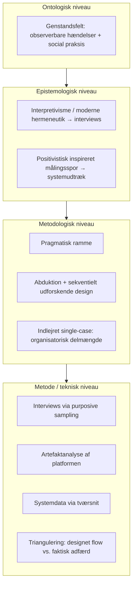

# Synopsis — Videnskabsteori (Theory of Science)

**Emne:** AI-automatiseret matching og spildtid i bemandingsprocessen — Support Solutions ApS / SoluTalent  
**Procesafgrænsning:** fra modtaget opgave til klientindstillet konsulent (funktionelt: `staging_imported` → `matched` i SoluTalent)  
**Forfatter:** [PLACEHOLDER: Indsæt dit fulde navn her]  
**Studienummer:** [PLACEHOLDER: Indsæt dit studienummer her]  
**Institution:** Københavns Erhvervsakademi — Professionsbachelor i Økonomi & IT  
**Dato:** [PLACEHOLDER: Indsæt afleveringsdato her]

---

## 1. Titel

AI-understøttet matching og procesmæssigt spild i bemandingsprocessen: et pragmatisk research design for et indlejret casestudie hos Support Solutions ApS

## 2. Problemformulering

Hvordan kan sammenhænge mellem AI-understøttet kandidatforslag, manuelle valideringstrin og oplevet eller observerbart procesmæssigt spild i bemandingsprocessen beskrives og analyseres hos Support Solutions ApS i forløbet fra modtaget opgave til klientindstillet konsulent, og hvilke organisatoriske, teknologiske og tillidsmæssige forudsætninger fremstår hos informerede aktører som centrale for at kunne reducere resterende manuelle procestrin?

Spørgsmålet er åbent og undersøgende: formålet er kontekstuel indsigt og problematisering af praksis og systemgrænser, ikke påvisning af generel eller entydig kausal effekt af automatisering.

## 3. Afgrænsning

Analysen afgrænses til den del af værdikæden, der i organisationen håndteres som matching og bemandingsopgave understøttet af platformen SoluTalent, funktionelt fra opgaven er klar til behandling i det afgrænsede import- og matchforløb til konsulenten er matchet og klar til klientsamtale. Jobsourcing før registrering i denne kæde, kontrakt, fakturering, onboarding og øvrig post-match administration ligger uden for scope.

Undersøgelsen er funktionelt og procesorienteret på system- og arbejdsgangsniveau. Maskinlæringsarkitektur, modeltræning og kodekvalitet behandles ikke som genstandsfelt.

Casen er et indlejret single-case-studie: den indlejrede enhed er den organisatoriske delmængde hos Support Solutions, der arbejder med matching og bemandingsopgaven via SoluTalent — ikke en teknisk opdeling i platformens tilstande som selvstændig case-definition.

## 4. Research design

Forskningsdesignet begrundes ud fra spørgsmålets karakter: der efterspørges samtidig forståelse af meningsfulde beslutningsmønstre og af observerbare hændelser i et specifikt system i en enkelt organisation. Et bredt hypoteseeksperimentelt eller rent surveybaseret design ville hverken honorere den fortolkede dimension eller den nødvendige systemnære dokumentation og ville indebære statistisk generalisering, som studiet ikke er dimensioneret til. Et snævert fortolkende studie uden system- og hændelsesspor ville til gengæld vanskeliggøre afstemning mellem formelle procesregler og faktisk flow.

Designet struktureres derfor som progression fra ontologisk antagelse om genstandsfeltet over epistemologisk legitimering af evidensformer til metodologisk slutningsform og casevalg og videre til konkrete datatyper og analysegreb. Den overordnede ramme er pragmatisk: metodekombinationen begrundes som det, der bedst muligt understøtter besvarelse af problemformuleringen inden for den angivne afgrænsning, med eksplicit opmærksomhed på, hvad designet kan og ikke kan sige noget sikkert om (kontekstbundne mønstre og analytisk generalisering til teori snarere end populationsslutninger).

## 5. Videnskabsteoretisk ramme

### 5.1 Pragmatisk hovedposition

Projektet anlægger en pragmatisk videnskabsteoretisk position, hvor problemformuleringen prioriteres som styrende for valg af evidens og metoder frem for at lade enten ren fortolkning eller ren måling dominere uden behov (Holm, 2023; Saunders m.fl., 2023). Den strategiske begrundelse for at kombinere kvalitative og kvantificerende spor i ét studie forankres i Rossman og Wilson (1984), som giver en ramme for at sammentænke tal og tekst i et fælles evaluerings- og undersøgelsesdesign. Kuada (2012) anvendes i det følgende primært til præcise begrebsafgrænsninger af ontologi og epistemologi samt til kvalitetskriterier for det kvalitative spor — ikke som eneste bærende argument for den overordnede pragmatiske strategi.

### 5.2 Ontologi

Ontologi angår, hvad der antages at eksistere, og hvordan genstandsfeltet er beskaffent (Kuada, 2012). I denne undersøgelse forudsættes et genstandsfelt, hvor dele af virkeligheden kan beskrives som digitale hændelser og statusser i SoluTalent, som kan registreres og sammenstilles uden at være identiske med aktørernes oplevelse af arbejdsopgaven. Samtidig indgår organisatorisk praksis, fortolkning af risiko, kvalitet i match og tillid til forslag som en social dimension, der ikke reduceres til loglinjer alene (Holm, 2023). Ontologisk er analysen dermed tvetydig på en kontrolleret måde: den forholder sig til både observerbare spor og til meningsfuld handlen i kontekst.

### 5.3 Epistemologi

Epistemologi angår, hvordan viden om genstandsfeltet kan gøres gyldig (Kuada, 2012). Interviewbaseret viden om begrundelser, oplevet spild og barrierer håndteres inden for et fortolkende spor med interpretivisme og moderne hermeneutik som led i forståelse af udsagn i deres organisatoriske sammenhæng (Holm, 2023). Systemudtræk og KPI-baserede målinger håndteres som et positivistisk inspireret spor, hvor målet er konsistent registrering og sammenligning af observerbare mønstre efter klare definitioner — uden at postulere, at hele studiet dermed er logisk positivistisk. De to spor holdes begrebsmæssigt adskilt og sammenføjes i den pragmatiske ramme som komplementære måder at belyse samme afgrænsede proces på.

## 6. Metodologi og metode

### 6.1 Abduktiv tilgang

Slutningsformen er primært abduktiv: der veksles mellem empiriske observationer og teoretiske begreber, så overraskende mønstre i data kan føre til justering af begrebsbrug og omvendt (Holm, 2023). Abduktionen understøtter en skelnen mellem det, data kan indikere, og det, der kræver yderligere fortolkning eller sammenhæng med andre kilder, frem for at præsentere enkeltspor som endegyldige forklaringer.

### 6.2 Case-studie

Der anvendes et indlejret single-case-studie af Support Solutions med analytisk generalisering til teori som ambition for de teoretiske pointer, mens statistisk generalisering til branchen ikke er mål (Holm, 2023; Kuada, 2012; Saunders m.fl., 2023). Casevalget begrundes med behovet for dyb kontekstforståelse af samspillet mellem platform og praksis i en konkret SMV-kontekst frem for repræsentativ stikprøve på tværs af virksomheder.

### 6.3 Datagenerering / empiri

Empirien samles i tre spor: semistrukturerede interviews med aktører udvalgt efter formålsbestemt sampling (purposive sampling), fordi de besidder direkte erfaring med den afgrænsede proces (Saunders m.fl., 2023); systematisk artefaktanalyse af SoluTalent med fokus på automatiske flows, manuelle gate og beslutningspunkter som de fremgår af systemets funktionelle logik; samt systemudtræk defineret ud fra KPI’er og loggingsmuligheder i den afgrænsede periode. Den kvantitative del kan beskrives som et tværsnit i et eksplicit valgt tidsvindue med fokus på sager, der passerer gennem match-processen. Afhængigt af modenhed i drift kan de kvantitative spor fungere som dokumentation af mønstre i det valgte vindue eller som struktureret måleplan — i begge tilfælde med eksplicit beskrivelse af datadefinitioner og begrænsninger i metodekapitlet. Undersøgelsen kan med fordel følge et sekventielt udforskende design (Saunders m.fl., 2023), hvor kvalitative indsigter danner grundlag for at målrette spørgsmål og udtræk i systemsporet, uden at det løfter designet til hypotesebekræftelse på populationsniveau.

### 6.4 Triangulering

Triangulering anvendes som analysestrategi med et afgrænset formål: at synliggøre spænd og sammenfald mellem platformens formelt designede principper og den faktiske beslutningsadfærd og tidsmæssige forløb, som interviews og udtræk kan belyse fra hver sin vinkel (Rossman & Wilson, 1984). Trianguleringen er således ikke kun en opremsning af kilder, men et redskab til at afstemme udsagn, artefakt og hændelsesmønstre og til at markere, hvor tolkning og måling understøtter hinanden, og hvor de står i konflikt eller åbner for alternative læsninger.

## 7. Kvalitet, bias og begrænsninger

Forskningen involverer personer og interne processer; derfor indgår informeret samtykke og anonymisering som grundlæggende etiske hensyn (Kuada, 2012).

For det kvalitative spor anvendes Lincoln og Gubas kriterier formidlet gennem Kuada (2012): *credibility* understøttes blandt andet af triangulering og informantvalidering af centrale fortolkningsudsnit; *transferability* af tyk kontekstbeskrivelse af organisation og procesafgrænsning; *dependability* af dokumenteret sporbarhed i dataindsamling, guide og kodning; *confirmability* af reflekteret neutralitet og gennemsigtighed i konklusioner. For systemsporet tillægges målepålidelighed, sammenlignelighed over den valgte periode og afgrænsning af population af sager og hændelser betydning for, hvilke udsagn der kan understøttes af tallene (Saunders m.fl., 2023).

Forfatterens insider-relation til udvikling og kendskab til SoluTalent medfører risiko for bekræftelsesbias. Det imødegås ved systematisk inddragelse af artefakt og systemspor, ved ligebehandling af negative indikatorer såsom ventetid, afvisninger og overstyringer som af positive effektivitetssignaler, og ved eksplicit diskussion af begrænsninger i diskussionsdelen.

Studiet kan give indsigt i mønstre og forudsætninger i den beskrevne kontekst. Det kan ikke uden videre overføres statistisk til andre virksomheder eller bevise generelle årsagssammenhænge mellem automatisering og udfald. Kombinationen af fortolkning og måling reducerer ikke fuldstændigt usikkerhed omkring kausale mekanismer; den styrker derimod muligheden for nuanceret problematisering inden for den valgte afgrænsning.

## 8. Foreløbig disposition

1. Indledning og problemfelt  
2. Problemformulering, underspørgsmål og afgrænsning  
3. Teoretisk ramme (relevant for proces og teknologiorganisering, fx Lean-relateret spild, TOE, beslutningsstøtte — præcisering i hovedopgaven)  
4. Videnskabsteori og research design  
5. Metode og operationalisering (sampling, guides, artefaktgang, datadefinitioner, periode)  
6. Analyse (tematisk og kildekombineret efter underspørgsmål)  
7. Diskussion (implikationer, begrænsninger, insider-position)  
8. Konklusion  
9. Litteraturliste og bilag (samtykke, guideuddrag, datadefinitioner efter behov)

### Litteraturliste

Holm, A. B. (2023). *Videnskab i virkeligheden – En grundbog i videnskabsteori* (3. udg.). Samfundslitteratur.

Kuada, J. (2012). *Research Methodology: A Project Guide for University Students*. Samfundslitteratur.

Rossman, G. B. & Wilson, B. L. (1984). Numbers and Words: Combining Quantitative and Qualitative Methods in a Single Large-Scale Study. *Evaluation Review*, 9(5), 627–643.

Saunders, M. N. K., Lewis, P. & Thornhill, A. (2023). *Research Methods for Business Students* (9. udg.). Pearson.

---

## 9. Oversigtsfigur: research design

**Figur 1.** Research design. Progression fra ontologi til metode, forankret i den pragmatiske ramme. Teorier: Kuada (2012); Holm (2023); Saunders m.fl. (2023). Strategi for krydsning af metoder: Rossman og Wilson (1984).

---

## 10. Afleveringscheck (før aflevering)

- [ ] `PLACEHOLDER`-felter (navn, studienummer, dato) er udfyldt og slettet  
- [ ] Problemformulering er et HV-spørgsmål, afsluttet med `?`  
- [ ] Ontologi og epistemologi er opdelt i to særskilte underafsnit  
- [ ] Indlejret case er eksplicit defineret som en **organisatorisk delmængde** (ikke som workflow-states)  
- [ ] Rossman & Wilson (1984) bruges alene til strategi/triangulering, mens Kuada (2012) bruges til begrebsdefinitioner og kvalitetskriterier  
- [ ] Triangulering er beskrevet med et **analytisk formål** (at afdække forskellen på systemets design og menneskets adfærd)  
- [ ] Undersøgelsen er beskrevet som et **tværsnit** (kvantitativ del)  
- [ ] **Informantvalidering** indgår eksplicit under credibility-kriteriet  
- [ ] Der er redegjort for insider-bias og vigtigheden af negative indikatorer  
- [ ] Figur 1 er formateret og konverteret til PDF/Word (husk at Mermaid-blokken skal omdannes eller tegnes i relevant værktøj)
