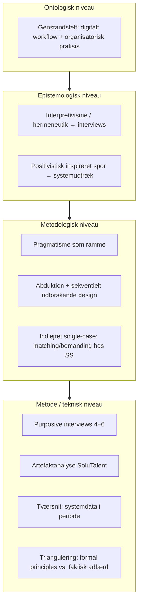

# Synopsis — Videnskabsteori (Theory of Science)

**Emne:** AI-automatiseret matching og spildtid i bemandingsprocessen — Support Solutions ApS / SoluTalent  
**Procesafgrænsning:** fra modtaget opgave til klientindstillet konsulent (funktionelt: `staging_imported` → `matched` i SoluTalent)  
**Forfatter:** [Indsæt fulde navn]  
**Institution:** Københavns Erhvervsakademi — Professionsbachelor i Økonomi & IT  
**Dato:** [Indsæt afleveringsdato]

---

## 1. Indledning

**Makroniveau:**  
På det skandinaviske marked for IT-kompetencer er hurtig og præcis bemanding en central konkurrenceparameter. Organisationer skal kunne omsætte efterspørgsel til mobilisering af konsulenter uden unødig forsinkelse i interne beslutningskæder.

**Mesoniveau:**  
Support Solutions ApS arbejder med leverance af konsulentkapacitet, hvor digital understøttelse af matching er et strategisk greb for at reducere ledetid og manuelt koordinationsarbejde. SoluTalent er den konkrete platform, hvor automatiske forslag og menneskelige vurderinger mødes i det daglige arbejde med at parre opgaver og konsulenter.

**Mikroniveau:**  
I den afgrænsede del af processen fra registreret opgave til klientindstillet konsulent opstår der beslutningsled, hvor manuelle godkendelser, overstyringer og gentagne gennemløb kan bidrage til ventetid og procesmæssigt spild. Spørgsmålet er derfor ikke primært, om AI «er god», men hvordan samspillet mellem systemlogik og organisatorisk praksis kan påvirke tidsforbrug og spild i et konkret workflow.

**Forskningsgab og synopsisens formål:**  
Der er behov for et kongruent research design, der kan legitimere både fortolkning af beslutningspraksis og dokumentation af observerbare mønstre i et digitalt arbejdsflow. Denne synopsis forsvarer derfor et sammenhængende valg af videnskabsteoretisk position, epistemologisk skelnen, metodologisk design, datatyper og kvalitetskriterier — i overensstemmelse med 7. semesters pensum (Holm, 2023; Kuada, 2012; Saunders et al., 2023) og med Rossman og Wilson (1985) som strategisk ramme for kombination af kvalitative og kvantitative logikker i samme undersøgelse.

---

## 2. Problemformulering, underspørgsmål og afgrænsning

### 2.1 Problemformulering

**Hvordan påvirker AI-baseret automatisering spildtid i bemandingsprocessen fra modtaget opgave til klientindstillet konsulent hos Support Solutions ApS, og hvilke forudsætninger kræver reduktion af de resterende manuelle procestrin?**

Formuleringen er bevidst åben (hvordan), fordi projektet søger kontekstuel og anvendelsesorienteret indsigt frem for endegyldig lovmæssighed på tværs af populationer. I konklusion og diskussion skal påvirkning ikke oversættes til kausalitet uden evidenskæde (Holm, 2023).

### 2.2 Underspørgsmål

1. Hvor i det afgrænsede workflow optræder ventetid og procesmæssigt spild som mest problematisk i praksis?  
2. Hvilke trin i SoluTalent er automatiserede, og hvilke forbliver menneskeligt styrede eller godkendelseskrævende?  
3. Hvilke målepunkter og systemisk dokumentation kan understøtte analyse af beslutningsforløb, gentagelse (rework) og overstyringer i den valgte periode?  
4. Hvilke forudsætninger og barrierer — teknologiske, organisatoriske og tillidsmæssige — knytter sig til yderligere automatisering eller til opretholdelse af manuelle kontroller?

### 2.3 Afgrænsning

Undersøgelsen afgrænses til den systemunderstøttede del af bemandingsprocessen i SoluTalent fra `staging_imported` til `matched`. Aktiviteter før registrering i platformen samt post-match-forløb (fx kontrakt, onboarding, fakturering og bred administrativ opfølgning) ligger uden for analysefeltet.

Analysen er **funktionel og procesorienteret**: fokus er beslutningsadfærd, arbejdsdeling mellem menneske og system, og observerbare mønstre i workflow — **ikke** udvikling, træning eller teknisk evaluering af maskinlæringsmodeller.

Casen forstås som et **indlejret single-case-studie** (Holm, 2023; Kuada, 2012): den organisatoriske delmængde er den del af Support Solutions, der arbejder med matching og bemanding i SoluTalent. Tekniske tilstande i platformen er **analytisk kontekst**, ikke definitionen på «indlejret case».

---

## 3. Redegørelse for research design

Research designet præsenteres i **fire vidensniveauer**: ontologi → epistemologi → metodologi → metode/teknisk niveau (jf. undervisningens struktur og Saunders et al., 2023). Detaljeret operationalisering og fuld måleplan hører til bachelorprojektets metodekapitel; synopsen begrunder kun designvalgene.

### 3.1 Videnskabsteoretisk position: pragmatisme

Projektet anlægger en **pragmatisk** position: problemformuleringen er handlings- og anvendelsesorienteret, og genstandsfeltet rummer både fortolkede praksisser og observerbare hændelser i et digitalt workflow (Holm, 2023; Saunders et al., 2023).

**Kuada** (2012) anvendes til korte begrebsdefinitioner og til at forankre undersøgelsens metodiske logik i et projektvejledt perspektiv. **Den strategiske begrundelse** for at kombinere kvalitative og kvantitative spor i samme undersøgelse — og for at lade forskningsspørgsmålet styre metodevalget — forankres i **Rossman og Wilson** (1985), som eksplicit adresserer integration af «numbers and words» i ét design.

### 3.2 Ontologi

**Ontologi** behandles som spørgsmålet om, hvad der antages at eksistere inden for genstandsfeltet (Kuada, 2012).

I denne case antages et genstandsfelt, hvor **digitale hændelser** (statusser, tidsstempler, beslutningsknudepunkter i platformen) kan studeres som observerbare forhold, samtidig med at **organisatorisk praksis** (prioriteringer, risikoafvejninger, fortolkning af «god match») udgør en social dimension, der ikke reduceres til logfiler alene (Holm, 2023). Ontologisk er der tale om et komplekst genstandsfelt, hvor teknisk infrastruktur og menneskelig handling samproducerer udfald — uden at platformens tilstande erstatter den organisatoriske case-definition.

### 3.3 Epistemologi

**Epistemologi** behandles som spørgsmålet om, hvordan viden om genstandsfeltet kan legitimere sig (Kuada, 2012). Her skelnes der **tydeligt** mellem spor, så klassisk positivisme ikke placeres under fortolkende epistemologi (jf. vejledningsnote).

- **Fortolkende spor (interpretivisme; moderne hermeneutik):** Semistrukturerede interviews anvendes til at belyse mening, begrundelser og kontekstuelle hensyn — fx omkring overstyringer, tillid til forslag og organisatoriske «sikkerhedsventiler» (Holm, 2023; Saunders et al., 2023). Hermeneutisk forstås udsagn som bundet til sprog og situation; fortolkning er en eksplicit del af vidensproduktionen.

- **Spor med positivistisk inspiration:** Systemudtræk og definerede målepunkter behandles som **observerbare og sammenlignelige** data om forløb i det afgrænsede workflow. Dette er et **målingsspor**, ikke et krav om at hele studiet skal underordnes historisk positivistisk programatik; det placeres som et supplement under den overordnede pragmatiske ramme (Holm, 2023; Saunders et al., 2023).

De to spor kombineres ikke i én epistemologisk label, men holdes adskilt i redegørelsen for at sikre begrebsmæssig kongruens.

### 3.4 Metodologi: slutningsform, design og case

**Slutningsform:** Primært **abduktiv** (Holm, 2023): empiriske observationer sættes i dialog med teoretiske begreber om spild, adoption og beslutningsstøtte, og forklaringer justeres, når data ikke understøtter foreløbige antagelser.

**Design:** **Sekventielt udforskende** design (Saunders et al., 2023): typisk **kvalitativ forforståelse først** (interviews), derefter **kvantitativ opfølgning** i form af systemisk dokumentation i en defineret periode. Rækkefølgen begrunder metodetriangulering som proces, ikke som vilkårlig metodeblanding.

**Case:** **Indlejret** single-case-studie med analytisk generalisering til teori (Holm, 2023; Kuada, 2012) — ikke statistisk generalisering til en population.

### 3.5 Metode og triangulering

Empirien kombinerer:

1. **Semistrukturerede interviews** med **purposive sampling** (Saunders et al., 2023) — typisk 4–6 informanter med roller, der dækker beslutnings- og udførelsesniveau i den afgrænsede proces.  
2. **Artefaktanalyse** af SoluTalent som digitalt artefakt: funktionel kortlægning af beslutningsflow, manuelle gates og systemets «formelle principper» (fx hvad der kan automatiseres under hvilke betingelser).  
3. **Systemiske udtræk** knyttet til det afgrænsede workflow i en **angivet tidsperiode** (tværsnit).

**Triangulering** opfattes ikke som en opremsning af tre kilder, men som et **analytisk redskab**: at synliggøre spændet mellem **formelt designede regler i platformen** og **faktisk beslutningsadfærd** i organisationen (Rossman & Wilson, 1985). Interview og artefakt kan fx forklare, hvorfor målbare ventetider opstår, selv når teknisk flow er «åbent».

### 3.6 Tidshorisont og repræsentativitet (kvantitativ del)

Den kvantitative del beskrives som et **tværsnit**: data indsamles i en **afgrænset periode** og på tværs af den relevante gruppe af sager/roller i casen, så mønstre kan sammenlignes inden for samme ramme (Saunders et al., 2023). Resultaterne har **kontekstuel gyldighed** for den valgte periode og population — ikke universelle påstande om hele branchen.

I en **pre-go-live** eller begrænset live-situation kan KPI-struktur ofte forstås som **måleplan og loggingkrav** frem for færdige driftresultater; dette indgår som metodisk transparens snarere end som dokumentation af endelig effekt.

---

## 4. Empiri (oversigt til synopsis)

| Kilde | Funktion i designet |
|--------|----------------------|
| Interviews | Fortolkning af praksis, begrundelser, barrierer og risikoafvejninger |
| Artefakt | Uafhængig beskrivelse af systemlogik og manuelle knudepunkter |
| Systemdata / udtræk | Observerbare mønstre i forløb, herunder indikatorer for ventetid, overstyringer og afvisninger, defineret konsistent i tværsnittet |

Ingen enkeltkilde kan alene besvare problemformuleringen om spildtid og manuelle trin i samspillet mellem AI-forslag og organisatorisk praksis; kombinationen er derfor begrundet strategisk (Rossman & Wilson, 1985).

---

## 5. Etik (aksiologi) og kvalitetskriterier

### 5.1 Aksiologi

Forskningen involverer personer og virksomhedsdata. **Aksiologisk** prioriteres gennemsigtighed, informerede samtykker, anonymisering i rapportering og ansvarlig databehandling i overensstemmelse med gældende regler og organisationens retningslinjer (Kuada, 2012).

### 5.2 Kvalitative kvalitetskriterier (Lincoln & Guba via Kuada, 2012)

| Kriterium | Kort praksis i projektet |
|-----------|---------------------------|
| **Credibility** | Triangulering; **informantvalidering** af centrale fortolkninger ved at returnere udsnit med beskrivelse af den kontekst, de skal bruges i, så informanten kan bekræfte, rette eller afvise |
| **Transferability** | Tyk kontekstbeskrivelse af Support Solutions og den afgrænsede SoluTalent-proces |
| **Dependability** | Audit trail: interviewguide, sporbar kodning og dokumenterede beslutninger undervejs |
| **Confirmability** | Spor fra konklusion til empiriske observationer; særligt ved insider-position (se nedenfor) |

### 5.3 Kvantitative kvalitetskriterier

**Målepålidelighed** (klare definitioner af udtræk og variabler), **stabilitet** over den valgte periode (sammenlignelighed inden for tværsnittet) og **repræsentativitet inden for den afgrænsede population** af sager og tidsrum (Saunders et al., 2023).

### 5.4 Insider-position og bias

Forfatteren kan have insider-adgang gennem praktik og/eller medudvikling af platformen. Det giver nærhed, men øger risiko for bekræftelsesbias. Det imødegås ved at behandle **negative indikatorer** (fx høj override rate, gentagne afvisninger, lange beslutningsforløb) som analytisk **lige så centrale** som positive mønstre, og ved at lade artefakt og systemdata kunne **modsige** interviewfortolkninger (Rossman & Wilson, 1985).

---

## 6. Oversigtsfigur: research design

Nedenfor ses en oversigt over den logiske kæde fra vidensniveauer til empiri. Ved aflevering i Word/PDF kan figuren tegnes om efter undervisningens skabelon og indsættes som vektor- eller højopløsningsgrafik.

**Figur 1.** Research design fra ontologi til metode med pragmatisk ramme og triangulering som analytisk funktion. Begrebsmæssig forankring: Kuada (2012); Holm (2023); Saunders et al. (2023); strategisk kombination af spor: Rossman og Wilson (1985).

---

## 7. Foreløbig disposition (bachelorrapport)

1. Indledning og problemfelt  
2. Problemformulering, underspørgsmål og afgrænsning  
3. Teoretisk ramme (fx Lean-spild, TOE, DSS — i tråd med analysebehov)  
4. Metode og operationalisering (udfoldelse af synopsis, dataindsamling, analysestrategi)  
5. Analyse (struktureret efter underspørgsmål)  
6. Diskussion (implikationer, begrænsninger, bidrag)  
7. Konklusion  
8. Litteraturliste og bilag (interviewguide, samtykke, udtræksdefinitioner efter behov)

---

## 8. Litteraturliste (Harvard)

Holm, A. B. (2023). *Videnskab i virkeligheden – En grundbog i videnskabsteori* (3. udg.). Samfundslitteratur.

Kuada, J. (2012). *Research Methodology: A Project Guide for University Students*. Samfundslitteratur.

Rossman, G. B. & Wilson, B. L. (1985). Numbers and Words: Combining Quantitative and Qualitative Methods in a Single Large-Scale Study. *Evaluation Review*, 9(5), 627–643.

Saunders, M. N. K., Lewis, P. & Thornhill, A. (2023). *Research Methods for Business Students* (9. udg.). Pearson.

---

## 9. Afleveringscheck (før du trykker «send»)

- [ ] Navn, dato og evt. studienummer udfyldt efter institutionens krav  
- [ ] Problemformulering er et HV-spørgsmål med `?`  
- [ ] Ontologi og epistemologi er **to separate afsnit**  
- [ ] Indlejret case er forklaret som **organisatorisk delmængde**, ikke som workflow-states  
- [ ] Rossman og Wilson (1985) bærer **strategien** for mixed methods/triangulering; Kuada (2012) bruges til **definitioner og kvalitetskriterier**  
- [ ] Triangulering har **analytisk formål** (formelle principper vs. faktisk adfærd)  
- [ ] Tidshorisont (tværsnit) er **eksplicit**  
- [ ] Informantvalidering er nævnt under credibility  
- [ ] Insider-bias og negative indikatorer er adresseret  
- [ ] Ingen påstande om faktisk SoluTalent-performance uden reference til konkret empiri i den endelige rapport  
- [ ] Figur 1 eksporteret til PDF/Word efter behov (mermaid kan konverteres med værktøj eller tegnes om)

---

*Synopsis udarbejdet til individuel aflevering i videnskabsteori / forberedelse af bachelorprojekt om AI-automatisering og spildtid i bemandingsprocessen hos Support Solutions ApS.*
